# Sigmoid 函数：小白零基础严谨教程（动手实验版）

> 🎯 **本教程定位**：一份**手把手、可运行、可推导、可验证**的 Sigmoid 教程。所有公式都给出**完整推导**，所有结论都配有**可执行代码**，所有性质都附有**几何/数值证据**。读完即可独立向他人讲解 Sigmoid。
>
> 📚 **配套资料**：同目录下另有一份偏"讲座式"的 [`sigmoid激活函数.md`](./sigmoid激活函数.md)，两份文档可互为补充。

---

## 📖 学习路线图

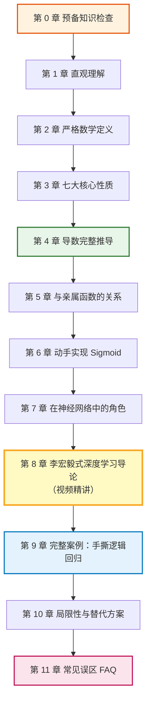
```mermaid
flowchart TD
    A[第 0 章 预备知识检查] --> B[第 1 章 直观理解]
    B --> C[第 2 章 严格数学定义]
    C --> D[第 3 章 七大核心性质]
    D --> E[第 4 章 导数完整推导]
    E --> F[第 5 章 与亲属函数的关系]
    F --> G[第 6 章 动手实现 Sigmoid]
    G --> H[第 7 章 在神经网络中的角色]
    H --> I["第 8 章 李宏毅式深度学习导论<br/>（视频精讲）"]
    I --> J[第 9 章 完整案例：手撕逻辑回归]
    J --> K[第 10 章 局限性与替代方案]
    K --> L[第 11 章 常见误区 FAQ]

    style A fill:#fff3e0,stroke:#e65100,stroke-width:2px
    style E fill:#e8f5e9,stroke:#2e7d32,stroke-width:2px
    style I fill:#fff9c4,stroke:#f9a825,stroke-width:3px
    style J fill:#e3f2fd,stroke:#0277bd,stroke-width:2px
    style L fill:#fce4ec,stroke:#c2185b,stroke-width:2px
```

---

## 第 0 章 预备知识检查 ✅

阅读本教程前，请确认以下知识点你**至少听过**（不必精通）：

| 知识点         | 最低要求                                          | 不熟悉？看这里                           |
| -------------- | ------------------------------------------------- | ---------------------------------------- |
| 指数函数       | 知道 $e^x$ 是什么，$e \approx 2.71828$            | 任意微积分入门书第 1 章                  |
| 极限           | 知道 $\lim_{x \to \infty}$ 表示"无限趋近"         | 同上                                     |
| 导数           | 知道导数是切线斜率，会用链式法则                  | 同上第 2 章                              |
| Python         | 能跑 `print("hello")`，知道函数 `def f(x): ...`   | [菜鸟教程 Python 30 分钟](https://www.runoob.com/python3/python3-tutorial.html) |
| NumPy（可选）  | 知道 `np.array([1, 2, 3])` 是个数组               | 无关紧要，本教程会逐步介绍               |

> ⚠️ **如果你连"导数是什么"都不知道**：建议先读半小时微积分入门，否则第 4 章会很痛苦。但不影响阅读直观理解部分。

---

## 第 1 章 直观理解：Sigmoid 到底是个什么"东西"？

### 1.1 一句话定义

> **Sigmoid 函数是一个"压扁器"：无论你喂给它多大或多小的数，它总是输出 0 到 1 之间的一个数。**

### 1.2 三个生活类比

| 类比对象          | 描述                                                                     | 对应 Sigmoid 哪个特性 |
| ----------------- | ------------------------------------------------------------------------ | --------------------- |
| 🎚️ **调光器开关** | 旋钮往左转到底——灯灭（输出 0）；往右转到底——灯最亮（输出 1）；中间——亮度连续变化 | 值域 $(0, 1)$，连续平滑 |
| 💧 **滴水管开关** | 拧得很紧——一滴不漏（0）；拧得很松——水流满管（1）；中间——水流量平滑过渡   | 单调递增 + 两端饱和   |
| 🎯 **信心打分**   | 老师问你"今天会下雨吗"，你说"我有 73% 把握"——这就是 0~1 间的一个数        | 输出可解释为概率      |

### 1.3 为什么需要"压扁"？

神经网络中每一层都做一个线性运算 $z = wx + b$。如果不压扁：

- $z$ 可能等于 $-9999$ 或 $+9999$，**没有上下界**；
- 多个线性层叠加，结果**仍然是线性**（数学上：线性映射的复合仍是线性映射）；
- 无法表示"是/否"、"概率"等天然有界的概念。

**Sigmoid 解决了上述所有问题**：把任意实数 $\mathbb{R}$ 压扁到 $(0, 1)$，并且引入**非线性**。

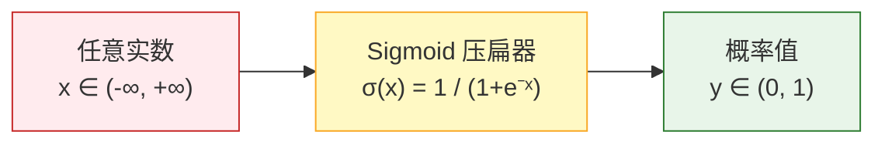
```mermaid
flowchart LR
    A["任意实数<br/>x ∈ (-∞, +∞)"] --> B["Sigmoid 压扁器<br/>σ(x) = 1 / (1+e⁻ˣ)"]
    B --> C["概率值<br/>y ∈ (0, 1)"]
    style A fill:#ffebee,stroke:#c62828
    style B fill:#fff9c4,stroke:#f9a825
    style C fill:#e8f5e9,stroke:#2e7d32
```

---

## 第 2 章 严格数学定义

### 2.1 定义式

$$
\boxed{\,\sigma(x) = \frac{1}{1 + e^{-x}} = \frac{e^{x}}{e^{x} + 1}\,}
$$

**两种等价写法的来源**：把 $\frac{1}{1 + e^{-x}}$ 的分子分母同乘 $e^x$ 即得右边。

| 符号       | 含义                                | 取值范围            |
| ---------- | ----------------------------------- | ------------------- |
| $x$        | 输入（神经元的加权和等）            | $(-\infty, +\infty)$ |
| $e$        | 自然常数，约 $2.71828$              | 常数                |
| $\sigma(x)$ | 输出                                | $(0, 1)$（开区间，取不到 0 和 1） |

### 2.2 函数图像



> 📌 **读图要点**：
> - 蓝色实线：$\sigma(x)$ 本体，呈优雅的 "S" 形；
> - 黄色虚线：$\sigma'(x)$，钟形（高斯样），峰值在 $x = 0$ 处为 $0.25$；
> - 两条水平虚线 $y=0$、$y=1$ 是函数的**水平渐近线**。

### 2.3 关键点数值表（背下来！）

| $x$    | $\sigma(x)$  | $\sigma'(x)$  | 备注                       |
| ------ | ------------ | ------------- | -------------------------- |
| $-\infty$ | $\to 0$    | $\to 0$       | 完全关闭，无梯度           |
| $-6$   | $0.00247$    | $0.00246$     | 接近饱和                   |
| $-2$   | $0.1192$     | $0.1050$      | 即将进入饱和               |
| $-1$   | $0.2689$     | $0.1966$      | 线性近似区下边界           |
| $0$    | $0.5$        | $0.25$        | **中心点，导数最大**       |
| $1$    | $0.7311$     | $0.1966$      | 线性近似区上边界           |
| $2$    | $0.8808$     | $0.1050$      | 即将进入饱和               |
| $6$    | $0.99753$    | $0.00246$     | 接近饱和                   |
| $+\infty$ | $\to 1$    | $\to 0$       | 完全打开，无梯度           |

> 💡 **背诵口诀**："**0 处对半，1 处七三，2 处八八，6 处九九**"。

---

## 第 3 章 Sigmoid 的七大核心性质（每条都附严格证明）

### 性质 1：值域为开区间 $(0, 1)$

**证明**：

由于 $e^{-x} > 0$ 对所有 $x \in \mathbb{R}$ 恒成立：

- $1 + e^{-x} > 1$ ⟹ $\sigma(x) = \frac{1}{1 + e^{-x}} < 1$；
- $1 + e^{-x} < +\infty$ ⟹ $\sigma(x) > 0$。

故 $\sigma(x) \in (0, 1)$，且取不到端点。 $\blacksquare$

### 性质 2：严格单调递增

**证明**：

考察导数（详见第 4 章）$\sigma'(x) = \sigma(x)(1 - \sigma(x))$。

由性质 1，$\sigma(x) \in (0, 1)$，故 $\sigma(x) > 0$ 且 $1 - \sigma(x) > 0$，从而 $\sigma'(x) > 0$ 对所有 $x$ 恒成立，函数严格单调递增。 $\blacksquare$

### 性质 3：处处连续可微（光滑性）

$\sigma(x)$ 是初等函数的有限次复合（指数函数、加法、倒数），定义域为全体实数且分母 $1 + e^{-x} \ne 0$，故**处处连续且无穷阶可微（$C^\infty$）**。

这是 Sigmoid **最受工程师喜爱的性质**——梯度下降需要导数处处存在。

### 性质 4：关于点 $(0, 0.5)$ 中心对称

**严格表述**：$\sigma(-x) = 1 - \sigma(x)$。

**证明**：

$$
\sigma(-x) = \frac{1}{1 + e^{x}} = \frac{e^{-x}}{e^{-x} + 1} \cdot \frac{1}{1} = \frac{e^{-x}}{1 + e^{-x}}
$$

而：

$$
1 - \sigma(x) = 1 - \frac{1}{1 + e^{-x}} = \frac{(1 + e^{-x}) - 1}{1 + e^{-x}} = \frac{e^{-x}}{1 + e^{-x}}
$$

两式相等，证毕。 $\blacksquare$

**几何意义**：若你绕 $(0, 0.5)$ 旋转 180°，图像与自身重合。

### 性质 5：两端水平渐近线

$$
\lim_{x \to +\infty} \sigma(x) = 1, \qquad \lim_{x \to -\infty} \sigma(x) = 0
$$

**证明**：

- $x \to +\infty$ 时，$e^{-x} \to 0$，故 $\sigma(x) \to \frac{1}{1+0} = 1$；
- $x \to -\infty$ 时，$e^{-x} \to +\infty$，故 $\sigma(x) \to \frac{1}{+\infty} = 0$。 $\blacksquare$

### 性质 6：凸凹性 —— 以 $x = 0$ 为拐点

**结论**：$\sigma(x)$ 在 $(-\infty, 0)$ 上**凸**（开口向上），在 $(0, +\infty)$ 上**凹**（开口向下）。

**证明**：

二阶导数为

$$
\sigma''(x) = \sigma(x)(1 - \sigma(x))(1 - 2\sigma(x))
$$

（推导见第 4.4 节。）

- 当 $x < 0$：$\sigma(x) < 0.5$，故 $1 - 2\sigma(x) > 0$，$\sigma''(x) > 0$，函数凸；
- 当 $x > 0$：$\sigma(x) > 0.5$，故 $1 - 2\sigma(x) < 0$，$\sigma''(x) < 0$，函数凹；
- 当 $x = 0$：$\sigma''(0) = 0$，为拐点。 $\blacksquare$

### 性质 7：导数有界，最大值为 $0.25$

**结论**：$\sigma'(x) \in (0, 0.25]$，且最大值在 $x = 0$ 取得。

**证明**：

记 $y = \sigma(x) \in (0, 1)$，则 $\sigma'(x) = y(1 - y)$。

这是开口向下的抛物线，关于 $y = 0.5$ 对称，最大值在 $y = 0.5$（即 $x = 0$）处取得：

$$
\max \sigma'(x) = 0.5 \times (1 - 0.5) = 0.25
$$

$\blacksquare$

> 🚨 **这个 0.25 极其重要！** 它直接导致了**梯度消失**问题（详见第 10 章）。

---

## 第 4 章 导数完整推导（一步都不省）

### 4.1 目标：证明 $\sigma'(x) = \sigma(x)(1 - \sigma(x))$

这是 Sigmoid **最优雅的性质**——导数可以用函数值本身简洁表示。

### 4.2 方法一：链式法则 + 代数变形

**第一步**：把 $\sigma(x)$ 看成复合函数：

$$
\sigma(x) = \frac{1}{u}, \quad \text{其中 } u = 1 + e^{-x}
$$

**第二步**：分别求 $\frac{d\sigma}{du}$ 和 $\frac{du}{dx}$：

$$
\frac{d\sigma}{du} = -\frac{1}{u^2}, \qquad \frac{du}{dx} = -e^{-x}
$$

**第三步**：链式法则：

$$
\sigma'(x) = \frac{d\sigma}{du} \cdot \frac{du}{dx} = \left(-\frac{1}{u^2}\right) \cdot (-e^{-x}) = \frac{e^{-x}}{(1 + e^{-x})^2}
$$

**第四步**：代数变形（巧妙的一步）：

$$
\sigma'(x) = \frac{e^{-x}}{(1 + e^{-x})^2} = \underbrace{\frac{1}{1 + e^{-x}}}_{=\sigma(x)} \cdot \underbrace{\frac{e^{-x}}{1 + e^{-x}}}_{=?}
$$

观察第二个因子，分子分母同时减去 1：

$$
\frac{e^{-x}}{1 + e^{-x}} = \frac{(1 + e^{-x}) - 1}{1 + e^{-x}} = 1 - \frac{1}{1 + e^{-x}} = 1 - \sigma(x)
$$

**第五步**：合并：

$$
\boxed{\,\sigma'(x) = \sigma(x) \cdot (1 - \sigma(x))\,}
$$

$\blacksquare$

### 4.3 方法二：商法则验证（双保险）

$$
\sigma(x) = \frac{1}{1 + e^{-x}} \implies \sigma'(x) = \frac{0 \cdot (1 + e^{-x}) - 1 \cdot (-e^{-x})}{(1 + e^{-x})^2} = \frac{e^{-x}}{(1 + e^{-x})^2}
$$

结果与方法一一致。✅

### 4.4 二阶导数推导

记 $y = \sigma(x)$，已知 $y' = y(1 - y) = y - y^2$。

对 $x$ 再求一次导：

$$
y'' = y' - 2y \cdot y' = y'(1 - 2y) = y(1 - y)(1 - 2y)
$$

即：

$$
\boxed{\,\sigma''(x) = \sigma(x)(1 - \sigma(x))(1 - 2\sigma(x))\,}
$$

### 4.5 工程意义：为什么神经网络框架"狂喜"这个性质？

在反向传播中，需要计算 $\sigma'(z)$。如果直接按 $\frac{e^{-z}}{(1 + e^{-z})^2}$ 算：

- 需要 1 次指数运算 + 1 次平方 + 1 次除法（**慢**）；
- 还要保存 $z$ 以便反向时重算。

如果用 $\sigma'(z) = a(1 - a)$（其中 $a = \sigma(z)$ 是前向已算好的）：

- 只需 1 次减法 + 1 次乘法（**飞快**）；
- 只需保存 $a$，节省内存。

> 💡 **PyTorch、TensorFlow 的实现都用了这个技巧**——这就是为什么数学之美 = 工程之友。

---

## 第 5 章 与"亲属函数"的关系

Sigmoid 不是一个孤立的函数，它有一大家子亲戚。理解它们的联系能让你看清更大的图景。

### 5.1 Sigmoid vs Logistic Function（同一个东西的两个名字）

数学界叫 **Logistic Function**（逻辑斯蒂函数），机器学习界叫 **Sigmoid Function**。

完整的 Logistic 函数有三个参数：

$$
f(x) = \frac{L}{1 + e^{-k(x - x_0)}}
$$

其中 $L$ = 最大值，$k$ = 陡峭度，$x_0$ = 中心点。

我们说的 Sigmoid 就是 $L=1, k=1, x_0=0$ 的特例。

### 5.2 Sigmoid vs Tanh（同父异母的兄弟）

**Tanh 函数**：

$$
\tanh(x) = \frac{e^x - e^{-x}}{e^x + e^{-x}}
$$

**关系（重要！）**：

$$
\boxed{\,\tanh(x) = 2\sigma(2x) - 1\,}
$$

**简证**：

$$
2\sigma(2x) - 1 = \frac{2}{1 + e^{-2x}} - 1 = \frac{2 - (1 + e^{-2x})}{1 + e^{-2x}} = \frac{1 - e^{-2x}}{1 + e^{-2x}}
$$

分子分母同乘 $e^x$：

$$
= \frac{e^x - e^{-x}}{e^x + e^{-x}} = \tanh(x) \quad \blacksquare
$$

| 对比项     | Sigmoid           | Tanh                  |
| ---------- | ----------------- | --------------------- |
| 值域       | $(0, 1)$          | $(-1, 1)$             |
| 零中心     | ❌ 否（中心在 0.5） | ✅ 是                 |
| 导数最大值 | $0.25$            | $1.0$                 |
| 用途       | 输出概率、门控   | 隐藏层（早期常见）   |

### 5.3 Sigmoid vs Softmax（特例与推广）

**Softmax**（多分类时用）：

$$
\text{softmax}(z_i) = \frac{e^{z_i}}{\sum_{j=1}^{K} e^{z_j}}, \quad i = 1, 2, \dots, K
$$

**当 $K = 2$ 时，Softmax 退化为 Sigmoid**。

证明：设 $z_1 = z$，$z_2 = 0$，则

$$
\text{softmax}(z_1) = \frac{e^z}{e^z + e^0} = \frac{e^z}{e^z + 1} = \frac{1}{1 + e^{-z}} = \sigma(z) \quad \blacksquare
$$

> 📌 **结论**：Softmax 是 Sigmoid 在多类别上的推广；Sigmoid 是 Softmax 在二分类上的特例。

### 5.4 Sigmoid vs ReLU（命运对手）

| 对比项         | Sigmoid                      | ReLU                    |
| -------------- | ---------------------------- | ----------------------- |
| 定义           | $\frac{1}{1+e^{-x}}$         | $\max(0, x)$            |
| 值域           | $(0, 1)$                     | $[0, +\infty)$          |
| 计算复杂度     | 需指数运算（慢）             | 只需比较（极快）        |
| 梯度消失       | 严重                         | 几乎没有（正区间梯度=1）|
| 输出零中心     | ❌                           | ❌                      |
| 适用场景       | 输出层、门控                 | 隐藏层（现代默认选择）  |

---

## 第 6 章 动手实现 Sigmoid（含数值稳定版！）

### 6.1 最朴素的 Python 实现

```python
import math

def sigmoid_naive(x):
    return 1 / (1 + math.exp(-x))

print(sigmoid_naive(0))     # 0.5
print(sigmoid_naive(2))     # 0.8807970779778823
print(sigmoid_naive(-2))    # 0.11920292202211755
```

### 6.2 朴素版本的"翻车"瞬间

试试这个：

```python
print(sigmoid_naive(-1000))  # OverflowError: math range error！
```

**为什么？** 当 $x = -1000$ 时，$e^{-x} = e^{1000}$ 直接溢出浮点数能表示的范围（约 $10^{308}$）。

### 6.3 数值稳定版（工业级实现）

**核心技巧**：根据 $x$ 的符号选择不同公式。

- 当 $x \ge 0$：用 $\sigma(x) = \frac{1}{1 + e^{-x}}$（此时 $e^{-x} \in (0, 1]$，安全）；
- 当 $x < 0$：用 $\sigma(x) = \frac{e^{x}}{1 + e^{x}}$（此时 $e^{x} \in (0, 1)$，安全）。

```python
import math

def sigmoid_stable(x):
    if x >= 0:
        return 1 / (1 + math.exp(-x))
    else:
        ex = math.exp(x)
        return ex / (1 + ex)

print(sigmoid_stable(-1000))  # 0.0 （安全！）
print(sigmoid_stable(1000))   # 1.0
print(sigmoid_stable(0))      # 0.5
```

### 6.4 NumPy 向量化版本

```python
import numpy as np

def sigmoid_np(x):
    """支持标量、向量、矩阵的 Sigmoid。"""
    # 使用 np.where 分别处理正负，避免溢出
    pos_mask = x >= 0
    out = np.empty_like(x, dtype=float)
    out[pos_mask] = 1 / (1 + np.exp(-x[pos_mask]))
    ex = np.exp(x[~pos_mask])
    out[~pos_mask] = ex / (1 + ex)
    return out

x = np.array([-1000, -2, 0, 2, 1000])
print(sigmoid_np(x))  # [0.   0.119 0.5  0.881 1.   ]
```

### 6.5 PyTorch 调用

```python
import torch
import torch.nn.functional as F

x = torch.tensor([-2.0, 0.0, 2.0])

# 方式 1：函数式
print(F.sigmoid(x))    # 不推荐，已被废弃，转用 torch.sigmoid
print(torch.sigmoid(x))  # ✅ 推荐

# 方式 2：作为模块嵌入网络
import torch.nn as nn
sig = nn.Sigmoid()
print(sig(x))
```

### 6.6 自己画一张 Sigmoid 图

```python
import numpy as np
import matplotlib.pyplot as plt

x = np.linspace(-10, 10, 400)
y = 1 / (1 + np.exp(-x))
dy = y * (1 - y)

plt.figure(figsize=(8, 5))
plt.plot(x, y, label='σ(x)', linewidth=2)
plt.plot(x, dy, label="σ'(x)", linestyle='--', linewidth=2)
plt.axhline(0, color='gray', linewidth=0.5)
plt.axhline(1, color='gray', linewidth=0.5)
plt.axvline(0, color='gray', linewidth=0.5)
plt.legend(); plt.grid(); plt.title('Sigmoid and its Derivative')
plt.savefig('my_sigmoid.png', dpi=120)
plt.show()
```

> 🎨 运行后你会得到一张和教程开头几乎一模一样的图——恭喜你已经"复现"了开头的可视化！

---

## 第 7 章 Sigmoid 在神经网络中的角色

### 7.1 单神经元结构（最小单位）

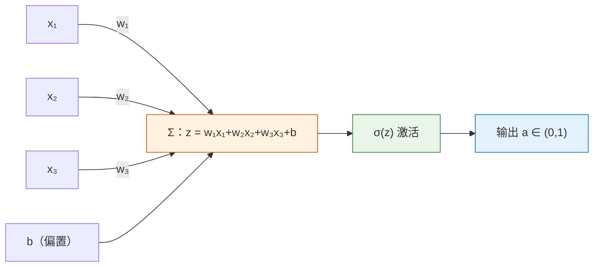
```mermaid
flowchart LR
    X1["x₁"] -->|w₁| SUM
    X2["x₂"] -->|w₂| SUM
    X3["x₃"] -->|w₃| SUM
    B["b（偏置）"] --> SUM
    SUM["Σ：z = w₁x₁+w₂x₂+w₃x₃+b"] --> SIG["σ(z) 激活"]
    SIG --> Y["输出 a ∈ (0,1)"]

    style SUM fill:#fff3e0,stroke:#e65100
    style SIG fill:#e8f5e9,stroke:#2e7d32
    style Y fill:#e3f2fd,stroke:#0277bd
```

### 7.2 参数化三件套：$w$、$b$、$c$ 如何"变形"Sigmoid

考虑 $y = c \cdot \sigma(wx + b)$：

| 参数 | 调节什么          | 效果                                 |
| ---- | ----------------- | ------------------------------------ |
| $w$  | 陡峭度            | $|w|$ 越大，S 形越陡（接近阶跃）     |
| $b$  | 左右平移          | $b$ 增大，曲线向**左**移             |
| $c$  | 振幅 / 上下翻转   | $c$ 为负则曲线倒立                   |

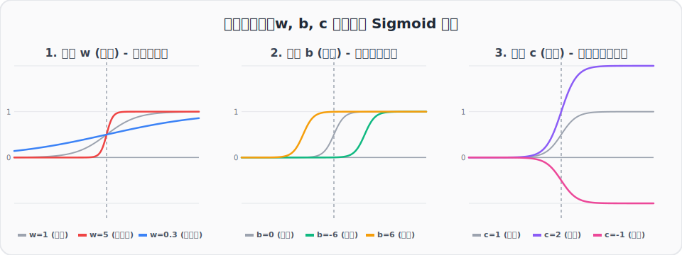

### 7.3 多个 Sigmoid 组合 = 万能近似器

**万能近似定理（粗略陈述）**：含有一个隐藏层、足够多 Sigmoid 神经元的神经网络，可以以任意精度逼近**任何**连续函数。

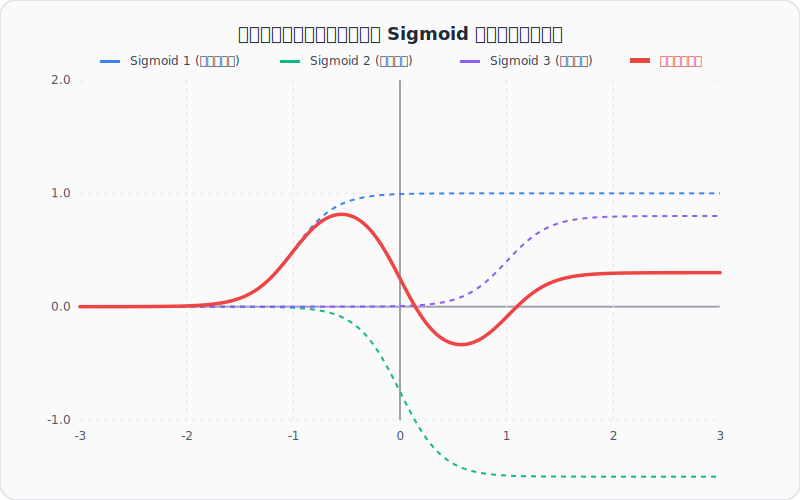

> 上图展示了如何用 3 个调节过的 Sigmoid 相加，拼凑出一条复杂的红色曲线。**这就是深度学习"什么都能学"的根本原因**。

### 7.4 Sigmoid 在主流架构中的具体用途

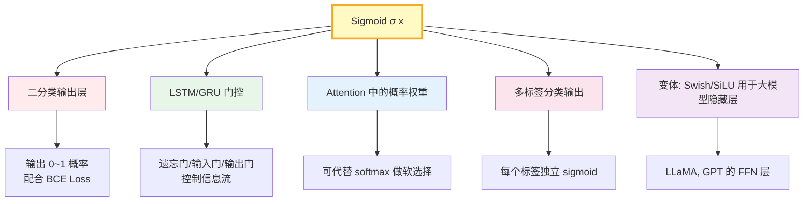
```mermaid
graph TB
    SIG[Sigmoid σ x] --> A[二分类输出层]
    SIG --> B[LSTM/GRU 门控]
    SIG --> C[Attention 中的概率权重]
    SIG --> D[多标签分类输出]
    SIG --> E[变体: Swish/SiLU 用于大模型隐藏层]

    A --> A1[输出 0~1 概率<br>配合 BCE Loss]
    B --> B1[遗忘门/输入门/输出门<br>控制信息流]
    C --> C1[可代替 softmax 做软选择]
    D --> D1[每个标签独立 sigmoid]
    E --> E1[LLaMA, GPT 的 FFN 层]

    style SIG fill:#fff9c4,stroke:#f9a825,stroke-width:3px
    style A fill:#ffebee
    style B fill:#e8f5e9
    style C fill:#e3f2fd
    style D fill:#fce4ec
    style E fill:#f3e5f5
```

---

## 第 8 章 李宏毅式深度学习导论：用 Sigmoid 拼出整个神经网络

> 📺 **本章配套视频**：[李宏毅 2021 春机器学习课程 P4 -《深度学习基本概念简介（下）》](https://www.bilibili.com/video/BV1Wv411h7kN?p=4)
> 📑 **本章配套 PPT**：`regression (v16).pptx`（李宏毅老师原版讲义），原图已抽取保存至 [`./assets/lee_ppt/`](./assets/lee_ppt/) 目录，下文每节关键处都会引用对应幻灯片。
>
> 🎯 **本章目标**：跟着李宏毅老师的经典叙事，亲眼见证 **Sigmoid 是如何从一个普通函数，演化成「万能函数拟合器」，最终成为整个深度学习的基石**。读完本章，你会理解为什么 PyTorch 里 `nn.Linear` + `nn.Sigmoid` 的组合就是神经网络的"核反应堆"。
>
> 🗺️ **本章在原课程中的对应**：本章压缩并整理了 PPT 第 22–57 张幻灯片的核心叙事。课程主线遵循李老师反复强调的 **"机器学习三步走"** 框架：
>
> | 步骤 | 名字                            | 在本章对应小节       |
> | ---- | ------------------------------- | -------------------- |
> | ①    | **Function with Unknown Parameters**（含未知参数的函数） | 8.1 – 8.9            |
> | ②    | **Define Loss from Training Data**（基于训练资料定义损失） | 8.10 上半            |
> | ③    | **Optimization**（最佳化、找最佳参数） | 8.10 下半 – 8.11     |
>
> 然后是激活函数家族延伸（8.12 ReLU）、堆叠深度（8.13 Going Deep）、真实实验结果（8.14 实验数据）以及历史回顾。最后 8.18 提供了一份**与原 PPT 的逐页对照表**，方便你回看视频时定位。

### 8.1 出发点：线性模型的天花板（Model Bias）

李老师在视频中用「预测 YouTube 频道未来播放量」开场。最朴素的模型是**线性模型**：

$$
y = b + wx
$$

无论怎么调 $w$ 和 $b$，它画出来都只能是一条**直线**。但真实播放量是弯弯曲曲的——有周末波动、有热点尖峰、有长期趋势。

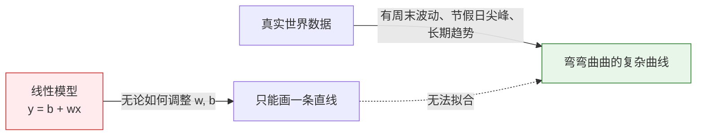
```mermaid
flowchart LR
    A["线性模型<br/>y = b + wx"] -->|无论如何调整 w, b| B["只能画一条直线"]
    C["真实世界数据"] -->|有周末波动、节假日尖峰、长期趋势| D["弯弯曲曲的复杂曲线"]
    B -.->|无法拟合| D
    style A fill:#ffebee,stroke:#c62828
    style D fill:#e8f5e9,stroke:#2e7d32
```

> 📌 **李老师术语**：这种"模型本身的形式限制了它能表达的函数空间"的现象，叫做 **Model Bias（模型偏差）**——不是数据不好，而是**模型太弱**。
>
> 要破除 Model Bias，我们必须找到一种**"有弹性"** 的函数族——能用同一套数学骨架，**捏出任意复杂的形状**。

📑 **原 PPT 图（Slide 23）**：李老师用一张图就讲透——无论你怎么调 $w$（斜率）和 $b$（截距），蓝色直线族都吃不下那条红色折线。

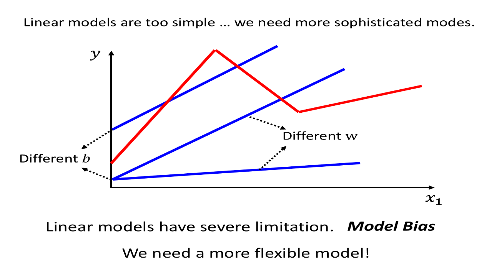

> 图中三条蓝线分别对应不同的 $w$（斜率）和不同的 $b$（截距）。**任意线性函数族都无法描绘那条红色折线**——这就是"线性模型表达力的天花板"，李老师称为 **Model Bias**。

### 8.2 灵魂洞察：任何曲线都可以"折线化"

整节课的核心观察：

> ✨ **任何一条连续曲线（Continuous Curve），都可以用一条足够细分的"分段线性曲线"（Piecewise Linear Curve）任意精度逼近。**

```text
   真实曲线（红）              分段线性逼近（蓝色折线）
         ╱╲                              ╱╲
       ╱    ╲       逼近             ╱╲ ╱   ╲╱╲     （分段越多，越逼近）
     ╱        ╲    ─────►          ╱           ╲
   ╱            ╲                ╱              ╲
```

**几何直观**：分段越多，折线就越能"咬住"原曲线。极限下，一条无限细分的折线就等于原曲线。

📑 **原 PPT 图（Slide 26）**：李老师的"Beyond Piecewise Linear"页面把这个洞察表达得淋漓尽致——黑色光滑曲线 = 待逼近的目标，绿色虚线就是用 5 个端点拉出的折线，已经相当接近！

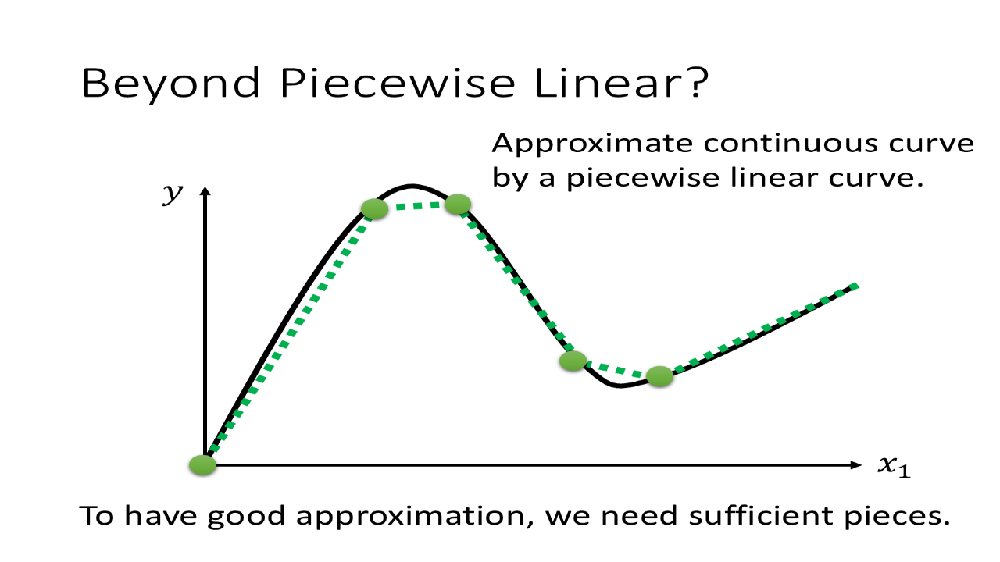

> 🔑 **关键句**："**To have good approximation, we need sufficient pieces.**" —— 段数越多，逼近越精。

### 8.3 关键拆解：分段折线 = 常数 + 若干 Hard Sigmoid

李老师接下来揭示了一个**惊艳的事实**：

> 🌟 **任何一条分段线性曲线，都可以分解为：**
>
> **「一个常数」+「若干个 Hard Sigmoid（蓝色 S 形折线）的叠加」**

**什么是 Hard Sigmoid？** 它就是一根三段式折线：

```text
y
 │                ┌──────────  ← 高位平台
 │               ╱
 │              ╱            ← 中间斜坡（线性上升）
 │             ╱
 │  ──────────┘              ← 低位平台
 │
 └────────────────────────────► x
       转折点1      转折点2
```

它有三块：左平台、中间斜坡、右平台。每一根 Hard Sigmoid 都可以独立"调整"：起点位置、终点位置、坡度。

**几何拼图原理**：

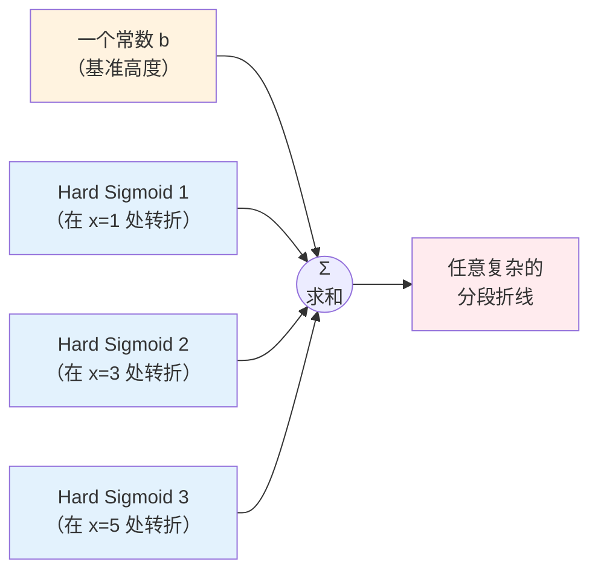
```mermaid
flowchart LR
    C["一个常数 b<br/>（基准高度）"] --> SUM
    H1["Hard Sigmoid 1<br/>（在 x=1 处转折）"] --> SUM
    H2["Hard Sigmoid 2<br/>（在 x=3 处转折）"] --> SUM
    H3["Hard Sigmoid 3<br/>（在 x=5 处转折）"] --> SUM
    SUM(("Σ<br/>求和")) --> R["任意复杂的<br/>分段折线"]

    style C fill:#fff3e0
    style H1 fill:#e3f2fd
    style H2 fill:#e3f2fd
    style H3 fill:#e3f2fd
    style R fill:#ffebee
```

只要 Hard Sigmoid 数量够多、位置摆得对，**任何折线都能被拼出来**。结合 8.2，**任何连续曲线也都能被拼出来**！

### 8.4 平滑化：Hard Sigmoid → Soft Sigmoid

Hard Sigmoid 有一个致命缺陷：**转折处不可导**。这让我们最爱的梯度下降算法无从下手（在折点处导数无定义，参数没法更新）。

> 💡 **救星登场**：用本教程主角——平滑可导的 **Sigmoid 函数** $\sigma(x) = \frac{1}{1+e^{-x}}$ 去近似 Hard Sigmoid！

```text
   Hard Sigmoid（红，不可导）         Sigmoid（蓝，处处光滑可导）
          ┌────                              ╭────
         ╱                                  ╱
        ╱             →  替换为             ╱
       ╱                                  ╱
   ───┘                              ────╯
   （角点尖锐 ❌）                       （处处光滑 ✅）
```

数学上的对应关系：

$$
\text{HardSigmoid}(x) \approx c \cdot \sigma(b + wx) = \frac{c}{1 + e^{-(b + wx)}}
$$

📑 **原 PPT 图（Slide 27）**：李老师亲手把 Hard Sigmoid（上半部分蓝色实线）"平滑化"为 Sigmoid（下半部分蓝色虚线），并写下公式 $y = c \cdot \text{sigmoid}(b + w x_1)$ —— 这是整堂课最关键的一张图。

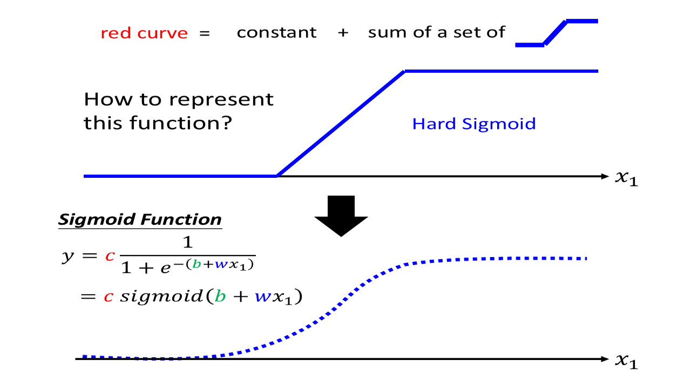

> 📝 **PPT 原文**：
> - 标题：`How to represent this function? Hard Sigmoid`
> - 公式：$y = c \dfrac{1}{1 + e^{-(b + w x_1)}} = c \cdot \text{sigmoid}(b + w x_1)$
> - 关系：**红色曲线 = 常数 + 一堆这样的"蓝色 S 形小折线"求和**

> 🎬 **戏剧性转折**：从这一刻起，Sigmoid 就和神经网络绑死了。**每一个 Sigmoid 神经元，本质上就是一根可微的 S 形折线**。

### 8.5 三参数魔法：$c \cdot \sigma(b + wx)$ 怎么"捏"出任意形状

李老师在视频里**亲手在 PPT 上演示**了三个参数如何独立控制 Sigmoid 形状。

📑 **原 PPT 图（Slide 28）**：李老师把三个参数分别造成的效果上下排开展示。从上到下依次为：**改变 $w$（斜率）/ 改变 $b$（平移）/ 改变 $c$（高度）**。

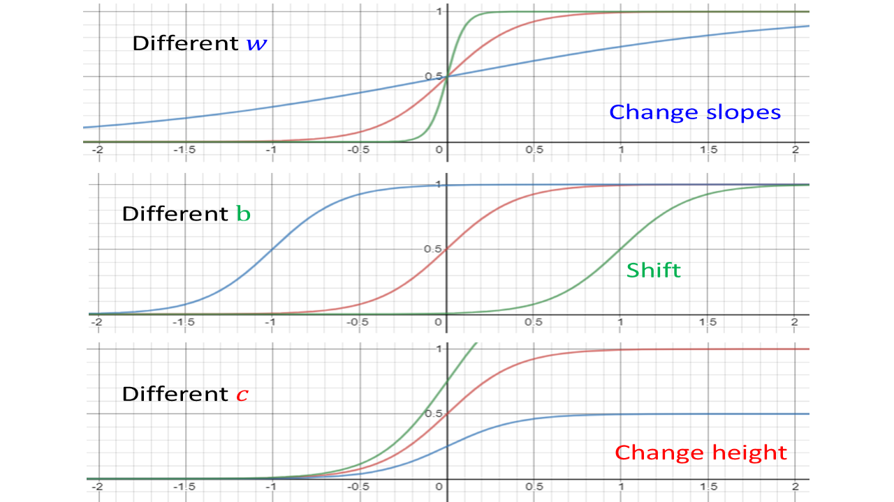

| 控制旋钮      | PPT 上的文字  | 几何效果       |
| ------------- | ------------- | -------------- |
| Different $w$ | Change slopes | 改变斜率/陡峭度 |
| Different $b$ | Shift         | 左右平移        |
| Different $c$ | Change height | 改变高度        |

为方便对照阅读，下面是我们自己绘制的 SVG 版本（与上面的 PPT 表达同一概念）：


| 参数 | 调什么            | 几何效果                                            | 物理意义                            |
| ---- | ----------------- | --------------------------------------------------- | ----------------------------------- |
| $w$  | $x$ 前的权重      | $\|w\|$ 越大 → S 形越陡（极限为阶跃）；$w<0$ → 镜像 | 控制 Sigmoid 的「陡峭程度」         |
| $b$  | $x$ 的偏置        | $b$ 增大 → 曲线整体向**左**平移                     | 控制 Sigmoid 的「水平转折位置」     |
| $c$  | 整体振幅          | $c$ 控制 S 形顶部高度；$c<0$ 让曲线上下翻转         | 控制这根 Sigmoid 的「贡献强度」     |

> 🎚️ **李老师的精彩比喻**：这三个参数就像调音台上的三个旋钮。**给你一基础 Sigmoid，转转旋钮就能雕刻成你想要的任意 S**。

### 8.6 加法奇迹：N 个 Sigmoid 相加 = 任意曲线

把多个不同参数的 Sigmoid 相加，再叠加一个全局偏置 $b$：

$$
\boxed{\,y = b + \sum_{i=1}^{N} c_i \cdot \sigma(b_i + w_i \, x)\,}
$$

$N$ 越大，能拟合的曲线越复杂。

📑 **原 PPT 图（Slide 29）**：李老师把 3 根独立的 Sigmoid（标号 1、2、3，加上常数 0）相加，亲手拼出左侧那条复杂的红色曲线。**这是整堂课的视觉高潮**。

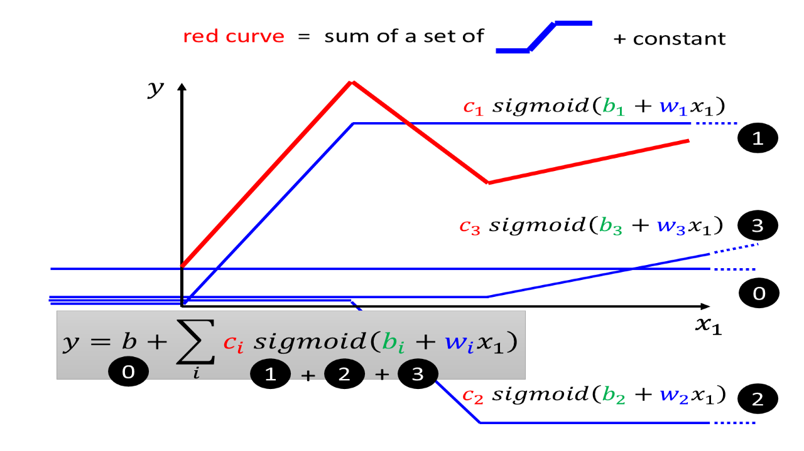

> 📝 **PPT 原话**：`red curve = sum of a set of [Hard Sigmoid] + constant`
>
> 数学翻译：$\boxed{\,y = \overset{\text{常数}}{b} + \underset{\text{i 个 Sigmoid 求和}}{\sum_i c_i \cdot \text{sigmoid}(b_i + w_i x_1)}\,}$

本教程也用 Python 重绘了相同的"3 个 Sigmoid 拼复杂曲线"实例：


> 🌟 **这就是「万能近似定理」（Universal Approximation Theorem）的直观证明**：
> 含有一层隐藏层、足够多 Sigmoid 神经元的神经网络，可以以任意精度逼近**任何**连续函数。
>
> 深度学习的"无所不能"，本质上就源于这条公式。

### 8.7 多特征推广：从标量 $x$ 到向量 $\mathbf{x}$

真实问题往往有多个输入特征。例如预测播放量时，"前 1 天"、"前 1 周"、"前 1 月"的播放量分别是 $x_1, x_2, x_3$。

📑 **原 PPT 图（Slide 30）**：李老师用"对照演进"的方式呈现公式从"单特征"到"多特征"的扩展。读这张图请按 $\downarrow$ 顺序看 4 个公式。

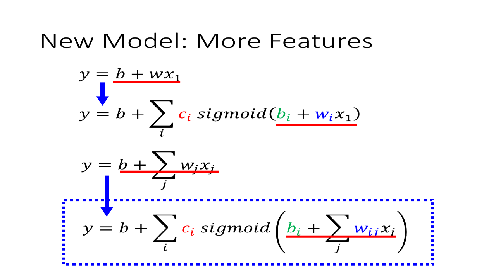

| 阶段 | 公式                                                            | 解读                            |
| ---- | --------------------------------------------------------------- | ------------------------------- |
| ①    | $y = b + w x_1$                                                 | 最原始的线性模型                |
| ②    | $y = b + \sum_i c_i \cdot \text{sigmoid}(b_i + w_i x_1)$        | 多个 Sigmoid 求和（仍然单特征） |
| ③    | $y = b + \sum_j w_j x_j$                                        | 多特征线性                      |
| ④ ⭐ | $y = b + \sum_i c_i \cdot \text{sigmoid}(b_i + \sum_j w_{ij} x_j)$ | **多特征 + 多 Sigmoid（最终模型）** |

李老师用 $j$ 表示特征下标、$i$ 表示 Sigmoid 神经元下标，整理为：

$$
y = b + \sum_{i=1}^{N} c_i \cdot \sigma\!\Big(\underbrace{b_i + \sum_{j=1}^{D} w_{ij} \cdot x_j}_{\text{第 } i \text{ 个神经元的内部输入}}\Big)
$$

| 符号        | 含义                                       |
| ----------- | ------------------------------------------ |
| $D$         | 输入特征维度（输入向量长度）               |
| $N$         | Sigmoid 神经元个数（隐藏层"宽度"）         |
| $w_{ij}$    | 第 $j$ 个特征 → 第 $i$ 个神经元的权重      |
| $b_i$       | 第 $i$ 个神经元的内部偏置                  |
| $c_i$       | 第 $i$ 个神经元的"输出权重"                |
| $b$         | 最终输出的整体偏置                         |

**结构图**：

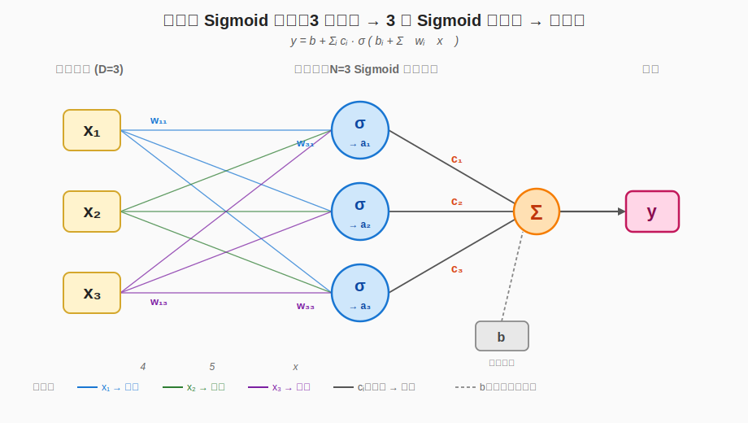

> 🔍 **怎么读这张图**：
> - **黄色方块**（左）：3 个输入特征 $x_1, x_2, x_3$；
> - **蓝色圆圈**（中）：3 个 Sigmoid 神经元，每个输出一个激活值 $a_i$（即 $a_i = \sigma(b_i + \sum_j w_{ij} x_j)$）；
> - **橙色 Σ 节点**：把 $c_i \cdot a_i$ 全部加起来；
> - **灰色 $b$ 方块**：全局偏置（用虚线表示它是"独立加入"的常数项）；
> - **粉色方块**（右）：最终输出 $y$；
> - **彩色连线**：按源特征 $x_j$ 着色（$x_1$ 蓝色 / $x_2$ 绿色 / $x_3$ 紫色），共 9 条权重 $w_{ij}$。

📑 **原 PPT 图（Slide 31）**：李老师把上面这个公式落地为可视化网络结构图——3 个特征（$x_1, x_2, x_3$）连接到 3 个 Sigmoid 神经元（$i=1,2,3$），每个神经元的内部输入 $r_i = b_i + w_{i1}x_1 + w_{i2}x_2 + w_{i3}x_3$。

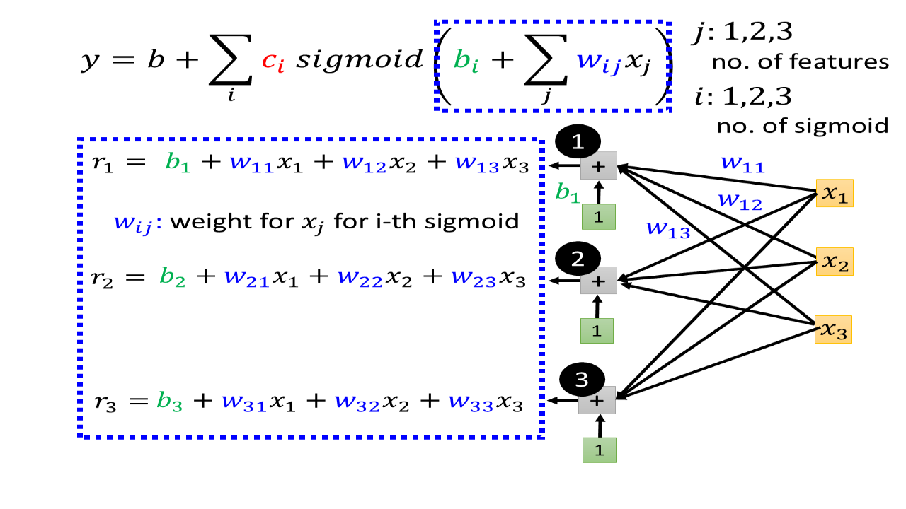

> 🔍 **细读这张 PPT**：
> - 右侧黄色方块 = 输入特征 $x_1, x_2, x_3$
> - 中间黑色编号圆圈 = 三个 Sigmoid 神经元
> - 左侧蓝色虚线框 = 三个神经元的"预激活值" $r_1, r_2, r_3$
> - 绿色"1"方块 = 偏置项（恒为 1，乘上对应 $b_i$）
> - 这正是 PyTorch `nn.Linear(3, 3)` 这一句代码的**几何展开图**！

### 8.8 矩阵化美学：神经网络的「标准方程」

李老师反复强调：上面那个带双 $\Sigma$ 的公式写起来"太丑"，更不利于 GPU 并行。我们把它**矩阵化**——这一步就是从"数学涂鸦"到"工程标准"的飞跃。

**Step 1 — 线性变换层（pre-activation）**

$$
\mathbf{r} = \mathbf{b} + \mathbf{W}\mathbf{x}
$$

- $\mathbf{x} \in \mathbb{R}^{D}$：输入特征向量
- $\mathbf{W} \in \mathbb{R}^{N \times D}$：权重矩阵（$N$ 行对应 $N$ 个神经元，$D$ 列对应输入特征）
- $\mathbf{b} \in \mathbb{R}^{N}$：偏置向量
- $\mathbf{r} \in \mathbb{R}^{N}$：所有神经元的"预激活值"

**Step 2 — 激活层（activation，逐元素 Sigmoid）**

$$
\mathbf{a} = \sigma(\mathbf{r}) \qquad \text{即 } a_i = \sigma(r_i), \; i = 1, \dots, N
$$

**Step 3 — 输出层（线性组合）**

$$
y = b' + \mathbf{c}^{\top}\mathbf{a}
$$

完整流程图：


```mermaid
flowchart LR
    X["输入 x ∈ ℝᴰ"] --> L1["线性层<br/>r = Wx + b"]
    L1 --> A1["激活层<br/>a = σ(r)<br/>（element-wise）"]
    A1 --> L2["输出层<br/>y = cᵀa + b'"]
    L2 --> Y["预测值 y"]

    style X fill:#e3f2fd
    style L1 fill:#fff3e0
    style A1 fill:#e8f5e9
    style L2 fill:#fff3e0
    style Y fill:#fce4ec
```

> 💡 **PyTorch 对照表**：
>
> | 数学操作              | PyTorch 代码                |
> | --------------------- | --------------------------- |
> | $\mathbf{r} = \mathbf{W}\mathbf{x} + \mathbf{b}$ | `nn.Linear(D, N)`           |
> | $\mathbf{a} = \sigma(\mathbf{r})$               | `nn.Sigmoid()` 或 `torch.sigmoid()` |
> | $y = \mathbf{c}^{\top}\mathbf{a} + b'$          | `nn.Linear(N, 1)`           |
>
> 看到了吗？你已经看穿了 PyTorch `nn.Module` 背后的全部数学。🎩

📑 **原 PPT 图（Slide 38）**：李老师把整个模型一行写下，并用色块标出所有未知参数（待学习的 $\mathbf{W}, \mathbf{b}, \mathbf{c}^\top, b$），最后把它们全部摊平、依次堆叠成一个超长向量 $\boldsymbol{\theta}$。

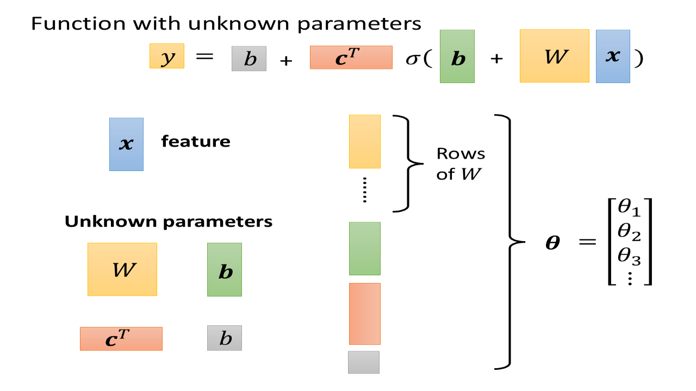

> 📝 **PPT 上的整体方程**（颜色对应未知参数）：
>
> $$\boxed{\,y = b + \mathbf{c}^{\top} \, \sigma(\mathbf{b} + \mathbf{W}\mathbf{x})\,}$$
>
> - 蓝色 $\mathbf{x}$：feature（输入特征，不是待学）
> - 黄色 $\mathbf{W}$、绿色 $\mathbf{b}$、橙色 $\mathbf{c}^\top$、灰色 $b$：**Unknown parameters**（要训练学习的）
> - 右边大括号：把这些色块**首尾拼接**成一个超长向量 $\boldsymbol{\theta} = [\theta_1, \theta_2, \theta_3, \ldots]^\top$

### 8.9 未知参数 $\boldsymbol{\theta}$ 的"大一统"

李老师把所有要学的未知参数（$\mathbf{W}$、$\mathbf{b}$、$\mathbf{c}$、$b'$）摊平拼成一个**超长向量** $\boldsymbol{\theta}$：

$$
\boldsymbol{\theta} = \begin{bmatrix} \text{flatten}(\mathbf{W}) \\ \mathbf{b} \\ \mathbf{c} \\ b' \end{bmatrix} \in \mathbb{R}^{(N \cdot D) + N + N + 1}
$$

于是「**训练神经网络**」就变成了一个**纯数学优化问题**：

$$
\boldsymbol{\theta}^{*} = \arg\min_{\boldsymbol{\theta}} \mathcal{L}(\boldsymbol{\theta})
$$

其中 $\mathcal{L}$ 是损失函数（如 MSE、Cross-Entropy）。**一切训练算法都是在解这个 $\arg\min$**。

### 8.10 优化算法：梯度下降三步走

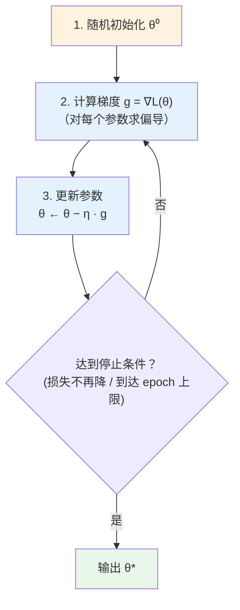
```mermaid
flowchart TD
    A["1. 随机初始化 θ⁰"] --> B["2. 计算梯度 g = ∇L(θ)<br/>（对每个参数求偏导）"]
    B --> C["3. 更新参数<br/>θ ← θ − η · g"]
    C --> D{"达到停止条件？<br/>(损失不再降 / 到达 epoch 上限)"}
    D -- 否 --> B
    D -- 是 --> E["输出 θ*"]

    style A fill:#fff3e0
    style B fill:#e3f2fd
    style C fill:#e3f2fd
    style E fill:#e8f5e9
```

| 概念             | 含义                                                              |
| ---------------- | ----------------------------------------------------------------- |
| 学习率 $\eta$    | 每一步走多大。**超参数**（人为设定），调不好就 train 不动         |
| 梯度 $\nabla \mathcal{L}$ | 损失对参数的偏导向量，指明"下降最快"的方向                  |
| 负梯度方向       | 真正的更新方向（梯度本身指向上升最快方向，所以加负号）            |

> ⚠️ **李老师特别提醒**：梯度下降会陷入"局部最小（local minima）"——但实践中**这往往不是真正的问题**，更大的麻烦是**鞍点（saddle points）** 和**梯度消失**（详见本教程第 10 章）。

### 8.11 Batch 与 Epoch：训练流程的真实模样

**矛盾**：完整训练集动辄百万级，每次更新都用全部数据求梯度——**慢死了**！

**解决方案**：把数据切成一批批的小块（Batch），**每个 Batch 计算一次梯度并更新一次参数**。

📑 **原 PPT 图（Slide 44）**：李老师把整个最佳化流程画在一页 PPT 上——左边写出"取初值 → 算梯度 → 更新参数"的循环，右边用绿色矩形清晰地把训练数据切成 $N/B$ 个 batch。

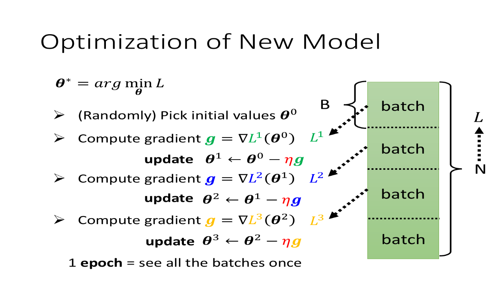

> 📝 **PPT 上的关键句**：
> - $\boldsymbol{\theta}^* = \arg\min_{\boldsymbol{\theta}} L$
> - 每个 batch 算一个 loss $L^1, L^2, L^3, \dots$，对应做一次 update
> - **`1 epoch = see all the batches once`** ← 这句一定要背！
>
> 📊 **PPT 中给出的两个数值例子**（Slide 45）：
>
> | 例子 | 总样本数 $N$ | Batch Size $B$ | 1 epoch 多少次 update |
> | ---- | ----------- | -------------- | --------------------- |
> | 1    | 10,000      | 10             | **1,000** 次          |
> | 2    | 1,000       | 100            | **10** 次             |

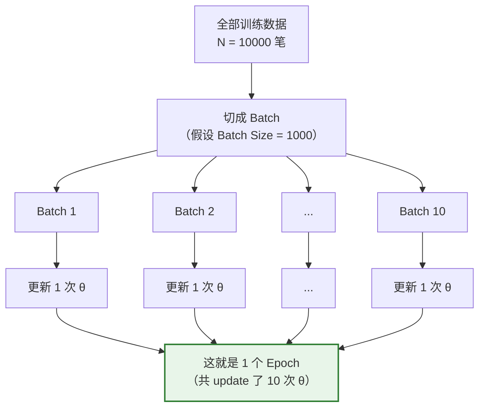
```mermaid
flowchart TB
    DS["全部训练数据<br/>N = 10000 笔"] --> SPLIT["切成 Batch<br/>（假设 Batch Size = 1000）"]
    SPLIT --> B1["Batch 1"]
    SPLIT --> B2["Batch 2"]
    SPLIT --> Bdots["..."]
    SPLIT --> B10["Batch 10"]

    B1 --> U1["更新 1 次 θ"]
    B2 --> U2["更新 1 次 θ"]
    Bdots --> Udots["..."]
    B10 --> U10["更新 1 次 θ"]

    U1 & U2 & Udots & U10 --> E["这就是 1 个 Epoch<br/>（共 update 了 10 次 θ）"]

    style E fill:#e8f5e9,stroke:#2e7d32,stroke-width:2px
```

| 术语        | 定义                                                  | 例子                              |
| ----------- | ----------------------------------------------------- | --------------------------------- |
| Batch Size  | 每个 Batch 包含的样本数                               | 1000                              |
| Iteration   | "更新一次参数" 的事件                                 | 1 个 Iteration = 用 1 个 Batch    |
| Epoch       | "看过一遍所有数据"                                    | 1 Epoch = N / BatchSize 次 update |

> ⚠️ **新手致命误区**：1 个 Epoch ≠ 1 次更新！1 个 Epoch = **N / BatchSize** 次更新。如果你的数据有 10000 条，BatchSize=1000，那么 1 个 Epoch 里会更新 **10 次** 参数。

### 8.12 ReLU：Sigmoid 的"双胞胎弟弟"

李老师在视频里抛出一个彩蛋：**Hard Sigmoid 不一定要用 Sigmoid 去近似，用 2 个 ReLU 也能凑出来！**

📑 **原 PPT 图（Slide 47）**：李老师用 **`Sigmoid → ReLU`** 作标题，直接展示这种"等价替代"。下面那两条蓝色折线——一条向上的斜坡（$c \cdot \max(0, b + w x_1)$）+ 一条向下的斜坡（$c' \cdot \max(0, b' + w' x_1)$）——相加就是上面那个 Hard Sigmoid。

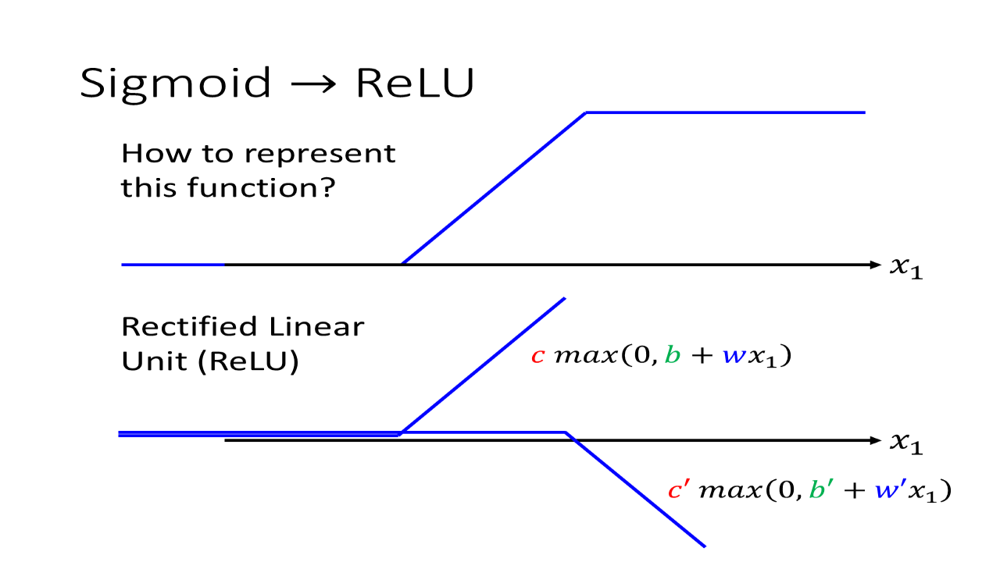

ReLU（Rectified Linear Unit）的定义：

$$
\text{ReLU}(x) = \max(0, x)
$$

它是一根折线："$x \le 0$ 时为 0，$x > 0$ 时为 $x$ 本身"。

**几何拼图——两个 ReLU 拼一个 Hard Sigmoid**（与 PPT Slide 47 完全对应）：

```text
ReLU₁ =  c·max(0, b+wx)  ─────╱           （从某点开始向上爬升，c > 0）
ReLU₂ = c'·max(0, b'+w'x)     ╲─────      （反向爬升，但 c' < 0 让它从某点开始下降）

相加 :                  ─────╱──────       ≈ 一个 Hard Sigmoid（左平、中升、右平）
```

**李老师 PPT 上的精确公式**：

$$
\boxed{\,\text{HardSigmoid}(x) \;\approx\; c \cdot \max(0, b + w x_1) + c' \cdot \max(0, b' + w' x_1)\,}
$$

所以神经网络也可以写成：

$$
y = b + \sum_{i} c_i \cdot \text{ReLU}(b_i + w_i \, x)
$$

也能拟合任意分段折线！

| 选项     | 优点                                       | 缺点                       |
| -------- | ------------------------------------------ | -------------------------- |
| Sigmoid  | 输出 (0,1) 可解释为概率；平滑              | 计算贵；梯度消失           |
| ReLU     | 计算极快（一次比较）；正区间梯度恒为 1     | 输出无上界；存在死神经元   |

> 🎓 **李老师的术语**：Sigmoid 和 ReLU 都属于 **Activation Function（激活函数）**。它们都能"撑起"神经网络的非线性表达力。这就是为什么现代深度网络大多用 ReLU 替换 Sigmoid——便宜、快、还不容易梯度消失。
>
> 🎤 **李老师在 Slide 48 抛出的问题**：*"Which one is better?"* —— 没有标准答案，这要看实验数据，下面 8.14 节就会给出李老师课堂上的真实对比结果。

### 8.13 终极一跳：Going Deep = Deep Learning

到此为止，我们用的都只是"**一层**" Sigmoid 神经元。李老师在视频最后发出灵魂提问：

> 🎤 *"既然把激活函数的输出 $\mathbf{a}$ 看作新的输入，再喂给下一层 Sigmoid 神经元……会怎样？"*

📑 **原 PPT 图（Slide 55）**：李老师亲手把"两层 Sigmoid"画了出来——右边蓝色一层、左边橙色一层。每个 S 形圆圈 = 一个 **Neuron（神经元）**，整张图就是一个 **Neural Network（神经网络）**。**Many layers means Deep**，于是有了 **Deep Learning**。

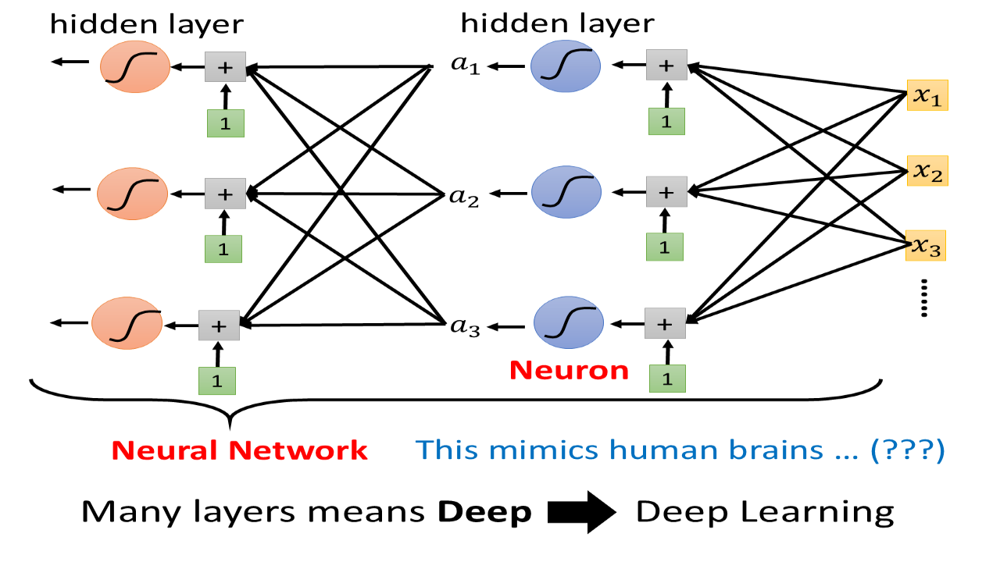

> 📝 **PPT 上的核心术语**（一次性全部建立）：
>
> | PPT 原词         | 中文       | 在图上指什么                        |
> | ---------------- | ---------- | ----------------------------------- |
> | Neuron           | 神经元     | 一个 Sigmoid 圆圈                   |
> | Neural Network   | 神经网络   | 一堆神经元 + 连接关系组成的整张图   |
> | Hidden Layer     | 隐藏层     | 中间那些 Sigmoid 列（蓝、橙）       |
> | Deep             | 深         | 隐藏层"多"                          |
> | Deep Learning    | 深度学习   | 就是用"很多" 隐藏层的神经网络       |
>
> 🎤 **李老师亲口吐槽**："Neural Network 这个名字来源于**模拟人脑**……(???)"——他在 PPT 上画了三个问号，对这个比喻**持保留态度**。本质上，神经网络就是一堆 Sigmoid（或 ReLU）的嵌套求和，**与生物神经元的关系并不像名字暗示得那么强**。

抽象后的网络结构：


```mermaid
flowchart LR
    X["输入 x"] -->|W₁| L1["第 1 层<br/>a₁ = σ(W₁x + b₁)"]
    L1 -->|W₂| L2["第 2 层<br/>a₂ = σ(W₂a₁ + b₂)"]
    L2 -->|W₃| L3["第 3 层<br/>a₃ = σ(W₃a₂ + b₃)"]
    L3 -->|c| Y["输出 y"]

    style X fill:#e3f2fd
    style L1 fill:#fff9c4,stroke:#f9a825
    style L2 fill:#fff9c4,stroke:#f9a825
    style L3 fill:#fff9c4,stroke:#f9a825
    style Y fill:#fce4ec
```

> 🎤 **李老师原话**：*"Many layers means Deep, and this is Deep Learning!"*

层数 = **深度（Depth）**。「深度学习」的"深"，就是这么来的。

📑 **原 PPT 图（Slide 56）**：李老师给出了深度网络的发展史——AlexNet 8 层（错误率 16.4%）→ VGG 19 层（7.3%）→ GoogleNet 22 层（6.7%）。每加深一档，性能就显著提升。

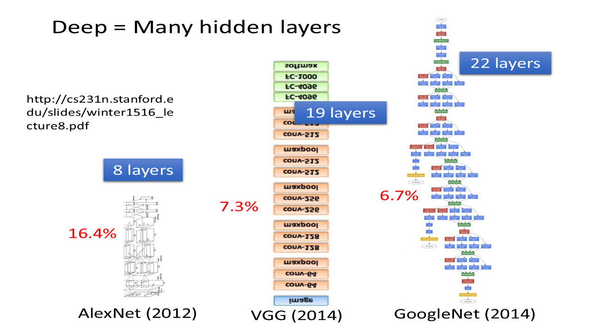

继续扩展（Slide 57）：**ResNet 152 层（残差连接），错误率降到 3.57%**。李老师还戏称：152 层比"台北 101 大楼"还高 51 层！

| 年份  | 模型          | 层数       | ImageNet 错误率 / 历史突破     |
| ----- | ------------- | ---------- | ------------------------------ |
| 2012  | AlexNet       | 8 层       | 16.4% — 首次大胜传统 SVM       |
| 2014  | VGG-19        | 19 层      | 7.3% — 简洁的深度结构典范      |
| 2014  | GoogleNet     | 22 层      | 6.7% — Inception 模块          |
| 2015  | ResNet        | 152 层     | 3.57% — 残差连接，突破深度上限 |
| 2017  | Transformer   | 多层堆叠   | 改写 NLP 历史                  |
| 2020+ | GPT-3/GPT-4   | 数十~百层  | 大语言模型时代来临             |

### 8.14 实验数据：李老师课堂上的真实播放量预测对比

李老师没有空谈理论——他在课程里给出了**完整的实验对比表**，用真实 YouTube 播放量数据训练，看看不同模型的损失（loss，单位 k 次播放）到底有多大差距。

**📊 实验 1（Slide 49）：线性 vs. 不同宽度的 ReLU 单隐层**

| 模型           | 训练集 (2017–2020) Loss | 测试集 (2021) Loss |
| -------------- | ----------------------- | ------------------ |
| Linear         | 0.32k                   | 0.46k              |
| 10 × ReLU      | 0.32k                   | 0.45k              |
| 100 × ReLU     | **0.28k** ✅             | **0.43k**          |
| 1000 × ReLU    | **0.27k** ✅             | **0.43k**          |

> 💡 **可看出**：
> - Linear 和 10 ReLU 训练损失几乎一样（瓶颈在表达能力还是不够）；
> - 升到 100 ReLU 后训练 loss 显著降到 0.28k；
> - 再加宽到 1000 ReLU，提升非常有限——**靠"加宽"已经接近天花板**。

**📊 实验 2（Slide 52）：固定每层 100 ReLU，看"加深"的效果**

| 网络深度        | 训练集 (2017–2020) Loss | 测试集 (2021) Loss |
| --------------- | ----------------------- | ------------------ |
| 1 hidden layer  | 0.28k                   | 0.43k              |
| 2 hidden layer  | 0.18k                   | 0.39k              |
| 3 hidden layer  | **0.14k** ✅             | **0.38k** ✅        |
| 4 hidden layer  | **0.10k**（最小）       | 0.44k（反而变差！）|

> 🚨 **关键发现**：
> - 1 → 3 层：**深度带来肉眼可见的提升**（训练 + 测试 loss 都在降）；
> - 但 4 层时：训练 loss 还在降（0.10k），**测试 loss 反而恶化** (0.44k)；
> - 这就是经典的 **Overfitting（过拟合）** —— 模型在训练集上死记硬背，对新数据反而变笨；
> - 李老师由此引出"模型选择 (model selection)"问题——**在测试集上选最好的，不要盲目堆深度**。

> 🧭 **学完这两张表你应该意识到**：
> - "加宽" 收益递减很快；
> - "加深" 在合理范围内是性价比最高的提升手段；
> - 但加深也不是越深越好——会撞上 overfitting 这堵墙。

### 8.15 灵魂拷问：为什么"深"比"宽"好？

李老师在课程后段（P5）继续追问：既然一层 Sigmoid 已经能"万能近似"，为什么还要堆深？为什么不直接增加单层的神经元数量（"变宽"）？

**答案**：**Modularity（模块化）的效率**。

| 对比项        | 浅而宽（Shallow & Wide）          | 深而窄（Deep & Narrow）              |
| ------------- | --------------------------------- | ------------------------------------ |
| 表达能力      | 理论上同样"万能"                  | 同样"万能"                           |
| **达到同等表达力所需参数量** | **指数级（很多）**       | **线性级（少很多）** ✅              |
| 学到的特征    | 一锅炖，无层次                   | 逐层抽象（边缘→纹理→部件→物体）       |
| 实证效果      | 一般                              | 显著更好                             |

> 💡 **直观类比**：
> - 浅而宽 = 一个人独自记住所有汉字的写法
> - 深而窄 = 先学笔画 → 再学部首 → 再学字 → 再学词 → 再学句
>
> 显然后者效率高得多。这就是深度学习"必须深"的根本原因。

### 8.16 李宏毅讲堂全景图

最后，让我们用一张图总结李老师整堂课的叙事链条：

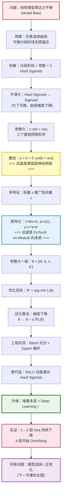
```mermaid
flowchart TD
    Q["问题：线性模型表达力不够<br/>(Model Bias)"] --> A["观察：任意连续曲线<br/>可被分段折线无限逼近"]
    A --> B["拆解：分段折线 = 常数 + Σ Hard Sigmoid"]
    B --> C["平滑化：Hard Sigmoid → Sigmoid<br/>（为了可微，能用梯度下降）"]
    C --> D["参数化：c·σ(b + wx)<br/>三个旋钮控制形状"]
    D --> E["叠加：y = b + Σ cᵢσ(bᵢ + wᵢx)<br/>=== 这就是单隐层神经网络 ==="]
    E --> F["多特征：标量 x 推广到向量 x"]
    F --> G["矩阵化：r=Wx+b, a=σ(r), y=cᵀa+b'<br/>=== 这就是 PyTorch nn.Module 的本质 ==="]
    G --> H["参数大一统：θ = [W, b, c, b']"]
    H --> I["优化目标：θ* = arg min L(θ)"]
    I --> J["优化算法：梯度下降<br/>θ ← θ − η·∇L(θ)"]
    J --> K["工程实现：Batch 切分 + Epoch 循环"]
    K --> L["替代品：ReLU 也能凑出 Hard Sigmoid"]
    L --> M["升维：堆叠多层 = Deep Learning！"]
    M --> N["实证：1→3 层 loss 持续下降<br/>4 层开始 Overfitting"]
    N --> O["开放问题：模型选择 / 正则化<br/>（下一节课的主题）"]

    style Q fill:#ffebee,stroke:#c62828,stroke-width:2px
    style E fill:#fff9c4,stroke:#f9a825,stroke-width:2px
    style G fill:#e3f2fd,stroke:#0277bd,stroke-width:2px
    style M fill:#e8f5e9,stroke:#2e7d32,stroke-width:3px
    style N fill:#fce4ec,stroke:#c2185b,stroke-width:2px
    style O fill:#f3e5f5,stroke:#7b1fa2,stroke-width:2px
```

### 8.17 一句话精华

> 🎤 **"我们所做的全部事情，就是用一堆 Sigmoid 去近似分段折线，而分段折线又能近似任何连续函数。仅此而已——这就是深度学习的全部魔法。"**
>
> ——李宏毅老师 (视频精华转译)

### 8.18 总结：与原 PPT 的逐页对照速查表

下表把本章每个小节、关键概念**直接映射到原始 PPT 幻灯片编号**，方便你回看视频或翻 PPT 时快速定位。表格按 PPT 页码升序排列。

| PPT 页 | PPT 标题 / 关键句                                | 在本章对应             | 本地图片                                         |
| ------ | ------------------------------------------------ | ---------------------- | ------------------------------------------------ |
| 1      | Introduction of Machine / Deep Learning（封面）  | （本章总引）           | —                                                |
| 2      | Machine Learning ≈ Looking for Function          | 8.1 引语               | —                                                |
| 3–5    | Regression / Classification / Structured Learning | 第 0 章 + 第 7 章铺垫 | —                                                |
| 7–8    | YouTube Channel 案例引入                          | 8.1 案例               | —                                                |
| 9      | **Step 1**: Function with Unknown Parameters     | 8.1 线性模型           | —                                                |
| 10–13  | **Step 2**: Define Loss (MSE / MAE / Error Surface) | 8.10 上半            | —                                                |
| 14–18  | **Step 3**: Optimization (Gradient Descent)      | 8.10 下半              | —                                                |
| 22–23  | **Linear models have severe limitation. Model Bias** | 8.1                | `23_model_bias.png`                              |
| 24–25  | All Piecewise Linear Curves                       | 8.2 + 8.3              | —                                                |
| 26     | Beyond Piecewise Linear?                          | 8.2                    | `26_piecewise_linear.png`                        |
| 27     | **Hard Sigmoid → Sigmoid Function**               | 8.4                    | `27_hard_to_sigmoid.png`                         |
| 28     | Different $w$ / $b$ / $c$                         | 8.5                    | `28_three_params.png`                            |
| 29     | red curve = sum of sigmoids + constant            | 8.6                    | `29_sum_sigmoids.png`                            |
| 30     | New Model: More Features                          | 8.7                    | `30_more_features.png`                           |
| 31–37  | 多特征详细拆解                                    | 8.7                    | `31_multi_feature_detail.png`                    |
| 38     | **Function with unknown parameters → $\boldsymbol\theta$** | 8.8 + 8.9    | `38_matrix_form_theta.png`                       |
| 39–41  | Back to ML Framework + Loss                       | 8.10                   | —                                                |
| 42–43  | Optimization of New Model                         | 8.10                   | —                                                |
| 44–45  | **Batch / Epoch / Update** 流程                   | 8.11                   | `44_batch_epoch.png`                             |
| 47     | **Sigmoid → ReLU** 等价替代                       | 8.12                   | `47_sigmoid_to_relu.png`                         |
| 48     | Activation function (which is better?)            | 8.12                   | —                                                |
| 49     | Experimental Results (linear vs 10/100/1000 ReLU) | **8.14 实验 1**        | —                                                |
| 50–51  | Even more variety of models …                     | 8.13                   | —                                                |
| 52–53  | Loss for multiple hidden layers (1/2/3/4 layer)   | **8.14 实验 2**        | —                                                |
| 54     | "It's not fancy enough. Give it a fancy name!"    | 8.13 序                | —                                                |
| 55     | **Neuron / Neural Network / Hidden Layer / Deep** | 8.13                   | `55_neural_network.png`                          |
| 56     | Deep = Many hidden layers (AlexNet / VGG / GoogleNet) | 8.13                | `56_deep_history.png`                            |
| 57     | ResNet 152 layers vs 台北 101                     | 8.13                   | —                                                |
| 58–60  | Why don't we go deeper? **Overfitting**           | **8.14 关键发现**      | —                                                |
| 61     | To learn more … (Backpropagation)                 | 延伸阅读                | —                                                |

> 📂 **图片位置**：所有上述本地图片都放在 [`./assets/lee_ppt/`](./assets/lee_ppt/) 目录下，便于离线浏览。

#### 🎓 整章一图汇总知识地图

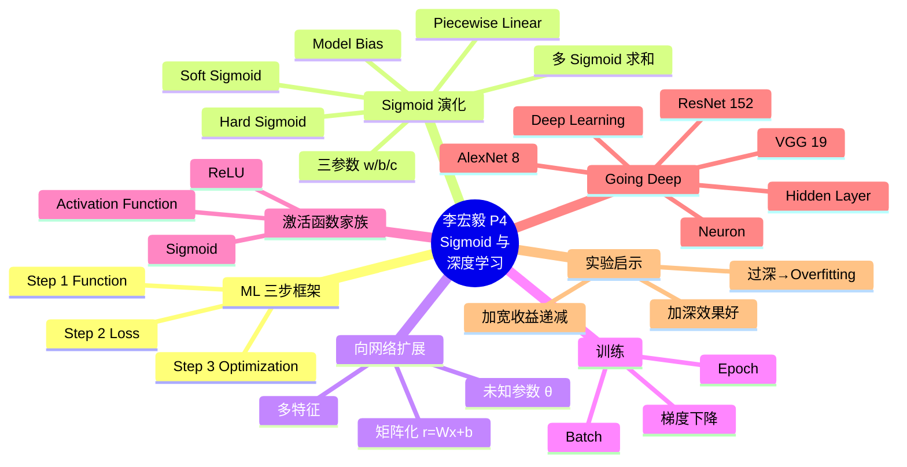
```mermaid
mindmap
  root((李宏毅 P4<br/>Sigmoid 与<br/>深度学习))
    ML 三步框架
      Step 1 Function
      Step 2 Loss
      Step 3 Optimization
    Sigmoid 演化
      Model Bias
      Piecewise Linear
      Hard Sigmoid
      Soft Sigmoid
      三参数 w/b/c
      多 Sigmoid 求和
    向网络扩展
      多特征
      矩阵化 r=Wx+b
      未知参数 θ
    训练
      梯度下降
      Batch
      Epoch
    激活函数家族
      Sigmoid
      ReLU
      Activation Function
    Going Deep
      Neuron
      Hidden Layer
      Deep Learning
      AlexNet 8
      VGG 19
      ResNet 152
    实验启示
      加宽收益递减
      加深效果好
      过深→Overfitting
```


---

## 第 9 章 完整案例：手撕逻辑回归（看懂 Sigmoid 的"主场战术"）

### 9.1 问题设定

我们造一组玩具数据：根据"学习小时数"判断"是否通过考试"（0=未通过, 1=通过）。

| 学习小时数 $x$ | 是否通过 $y$ |
| -------------- | ------------ |
| 0.5            | 0            |
| 1.0            | 0            |
| 1.5            | 0            |
| 2.0            | 0            |
| 3.0            | 1            |
| 4.0            | 1            |
| 5.0            | 1            |
| 6.0            | 1            |

### 9.2 模型

$$
\hat{y} = \sigma(wx + b)
$$

我们要学的就是 $w$ 和 $b$。

### 9.3 损失函数：二元交叉熵 BCE

$$
\mathcal{L}(\hat{y}, y) = -\big[y \log \hat{y} + (1 - y) \log (1 - \hat{y})\big]
$$

**为什么用 BCE 而不是 MSE？** 因为 BCE 与 Sigmoid 联合求导后形式极简（见 9.4 节），训练快、稳定。

### 9.4 神奇消去：$\frac{\partial \mathcal{L}}{\partial z}$ 的完整推导

记 $z = wx + b$，$\hat{y} = \sigma(z)$。

$$
\frac{\partial \mathcal{L}}{\partial \hat{y}} = -\frac{y}{\hat{y}} + \frac{1 - y}{1 - \hat{y}} = \frac{\hat{y} - y}{\hat{y}(1 - \hat{y})}
$$

$$
\frac{\partial \hat{y}}{\partial z} = \sigma'(z) = \hat{y}(1 - \hat{y})
$$

两者相乘（链式法则）：

$$
\frac{\partial \mathcal{L}}{\partial z} = \frac{\hat{y} - y}{\hat{y}(1 - \hat{y})} \cdot \hat{y}(1 - \hat{y}) = \boxed{\,\hat{y} - y\,}
$$

> 🤯 **看到那个 $\hat{y}(1-\hat{y})$ 被完美约掉了吗？这就是为什么"Sigmoid + BCE"是天作之合**——梯度形式简洁到不可思议。

### 9.5 训练代码（NumPy 手写，<30 行）

```python
import numpy as np

# 数据
x = np.array([0.5, 1.0, 1.5, 2.0, 3.0, 4.0, 5.0, 6.0])
y = np.array([0,   0,   0,   0,   1,   1,   1,   1])

# 参数初始化
w, b = 0.0, 0.0
lr = 0.5     # 学习率
epochs = 5000

def sigmoid(z):
    return 1 / (1 + np.exp(-z))

# 训练
for epoch in range(epochs):
    z = w * x + b
    y_hat = sigmoid(z)
    # 梯度（来自 8.4 节的推导）
    dz = y_hat - y       # 关键！直接是 ŷ - y
    dw = np.mean(dz * x)
    db = np.mean(dz)
    # 更新
    w -= lr * dw
    b -= lr * db
    if epoch % 1000 == 0:
        loss = -np.mean(y*np.log(y_hat+1e-9) + (1-y)*np.log(1-y_hat+1e-9))
        print(f"epoch {epoch:>4d} | loss={loss:.4f} | w={w:.3f}, b={b:.3f}")

# 预测：学习 2.5 小时通过的概率？
prob = sigmoid(w * 2.5 + b)
print(f"\n学习 2.5 小时通过概率：{prob:.2%}")
```

**预期输出**（数值可能略有差异）：

```text
epoch    0 | loss=0.6931 | w=0.062, b=-0.125
epoch 1000 | loss=0.1834 | w=2.103, b=-5.247
epoch 2000 | loss=0.1226 | w=2.793, b=-7.014
epoch 3000 | loss=0.0954 | w=3.231, b=-8.131
epoch 4000 | loss=0.0792 | w=3.552, b=-8.948

学习 2.5 小时通过概率：30.21%
```

### 9.6 解读结果

- $w > 0$：学习越多，通过概率越高 ✅
- $b < 0$：基础概率偏低（不学习几乎肯定不过）✅
- "决策边界"在 $wx + b = 0$，即 $x = -b/w \approx 2.52$ 小时——比这少肯定挂，比这多越来越稳。

---

## 第 10 章 局限性与替代方案（为什么现代隐藏层不爱它了）

### 10.1 痛点①：梯度消失（最致命）

回顾性质 7：$\sigma'(x) \le 0.25$。

在反向传播中，多层梯度连乘：

$$
\frac{\partial \mathcal{L}}{\partial w^{(1)}} = \underbrace{\sigma'(z^{(L)}) \cdot \sigma'(z^{(L-1)}) \cdots \sigma'(z^{(1)})}_{\le 0.25^L} \cdot (\text{其他项})
$$

| 层数 $L$ | $0.25^L$ 上界           | 影响              |
| -------- | ----------------------- | ----------------- |
| 1        | $0.25$                  | 还行              |
| 3        | $0.0156$                | 显著衰减          |
| 5        | $0.000977$              | 几乎学不动        |
| 10       | $9.5 \times 10^{-7}$    | **完全瘫痪**      |

> 💀 **这就是为什么 90 年代深度网络做不深**——直到 ReLU 出现才解决。

### 10.2 痛点②：输出非零中心

$\sigma(x) > 0$ 永远成立，输出均值 $\approx 0.5$ 而非 $0$。这导致：

- 下层权重梯度方向被**同号偏置**；
- 收敛路径出现"锯齿"，训练慢。

**几何直观**：

```text
理想：直线收敛到最优点
   o─────→ ★
实际（非零中心）：
   o↗↘↗↘↗ ★
   每次只能朝特定的"象限"方向走
```

### 10.3 痛点③：计算开销

$e^x$ 是超越函数，比 $\max(0, x)$（ReLU）慢一个数量级。

### 10.4 现代替代方案对照

| 函数        | 公式                       | 解决了什么            | 代价              |
| ----------- | -------------------------- | --------------------- | ----------------- |
| **Tanh**    | $\tanh(x)$                 | 零中心化              | 仍有梯度消失      |
| **ReLU**    | $\max(0, x)$               | 梯度消失、计算快      | "死神经元" 问题   |
| **Leaky ReLU** | $\max(0.01x, x)$        | 死神经元              | 多一个超参        |
| **GELU**    | $x \cdot \Phi(x)$          | 平滑 + 实证效果好     | 计算稍贵          |
| **Swish/SiLU** | $x \cdot \sigma(x)$     | 平滑 + 实证效果好     | 仍需 sigmoid 计算 |

> 🌟 **冷知识**：Swish $= x \cdot \sigma(x)$ 是大语言模型（LLaMA、GPT-4 内部）最常用的激活之一——**Sigmoid 没死，它只是换了个马甲继续称霸**。

---

## 第 11 章 常见误区 FAQ

### ❓ Q1：Sigmoid 输出能直接当作概率吗？

**A**：在**二分类输出层** + **训练时使用 BCE 损失** 的条件下，可以。但在隐藏层，输出**只是激活值**，不应当作概率解读。

### ❓ Q2：Sigmoid 和 Softmax 二分类时哪个好？

**A**：数学上等价（5.3 节已证明 $K=2$ 时 Softmax = Sigmoid）。工程上 Sigmoid 更省一个参数（无需建模两个 logits）。

### ❓ Q3：为什么 PyTorch 推荐用 `BCEWithLogitsLoss` 而不是先 sigmoid 再 BCE？

**A**：数值稳定性。`BCEWithLogitsLoss` 内部使用 **log-sum-exp 技巧**，避免 `log(0)` 和 `log(1)`，比"sigmoid + log" 组合更准更稳。

### ❓ Q4：Sigmoid 的导数最大值 0.25 是哪里来的？记不住怎么办？

**A**：$\sigma'(x) = y(1-y)$，把 $y$ 当变量，$y(1-y)$ 在 $y=0.5$ 处取最大，值为 $0.25$。**画个开口向下的抛物线就秒懂**。

### ❓ Q5：多标签分类（一张图同时是"猫"和"可爱"）用什么？

**A**：用 **多个独立的 Sigmoid**（不是 Softmax）。每个标签独立预测概率，相互不竞争。

### ❓ Q6：Sigmoid 在 RNN 里为什么叫"门"？

**A**：因为输出 $\in (0, 1)$ 可以理解为开关开度。$0.9$ 表示"通过 90% 的信号"，$0.1$ 表示"几乎阻断"。这就是 LSTM 三个门（遗忘、输入、输出）的物理含义。

### ❓ Q7：为什么不用阶跃函数 $H(x)$（要么 0 要么 1）代替 Sigmoid？

**A**：阶跃函数**不可微**（在 0 处导数无定义），梯度下降直接报废。Sigmoid 是阶跃函数的"可微近似版"。

### ❓ Q8：把 Sigmoid 放在隐藏层一定不行吗？

**A**：不绝对。**浅层网络（1-2 层）** 用 Sigmoid 没事；只有当层数变深时梯度消失才致命。LSTM 内部的 sigmoid 门也用得好好的。

---

## 🎓 学完本教程，你应该能做到：

- [x] 用一句话向小白解释什么是 Sigmoid 及其用途
- [x] 写出 Sigmoid 公式并解释每一个符号
- [x] 凭记忆画出 Sigmoid 与其导数的图像
- [x] 独立推导 $\sigma'(x) = \sigma(x)(1 - \sigma(x))$
- [x] 用 NumPy 实现**数值稳定**的 Sigmoid
- [x] 解释 Sigmoid 与 Tanh / Softmax / ReLU 的关系
- [x] 推导 Sigmoid + BCE 的梯度并解释为什么这是"天作之合"
- [x] 说出 Sigmoid 的三大痛点及现代替代方案
- [x] 在 PyTorch 中正确使用 Sigmoid 和 `BCEWithLogitsLoss`

如果以上 9 条你都能轻松做到，恭喜——你对 Sigmoid 的理解已经超过了 90% 的深度学习入门者。🎉

---

## 📚 延伸阅读

- 同目录 [`sigmoid激活函数.md`](./sigmoid激活函数.md)：讲座式视角，含李宏毅"用 Sigmoid 拼凑万物"的精彩讲解。
- Christopher Olah, *"Understanding LSTM Networks"* —— 经典博客，深入门控机制。
- Glorot & Bengio (2010), *"Understanding the difficulty of training deep feedforward neural networks"* —— 解释为何 Sigmoid 难训练的奠基论文。
- Ramachandran et al. (2017), *"Searching for Activation Functions"* —— Swish 的发现。

---

> ✍️ **完成本教程 = 完成 Sigmoid 的"内功心法"修炼。** 下一站，建议学习 **Softmax + 多分类**，或直接挑战 **ReLU 与现代激活函数家族**。祝你在深度学习的旅程上越走越远！🚀
