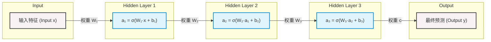

# Sigmoid 激活函数：从数学原理到神经网络实战的终极教程

> 💡 **导读**：在深度学习的浩瀚星空中，**Sigmoid 函数**（也称 S 型生长曲线函数）绝对是一颗承前启后的明星。无论是早期的感知机演变，还是如今大模型（如 Transformer）和循环神经网络（RNN）中的“门控机制”，Sigmoid 都扮演着不可或缺的角色。
> 本教程专为**零基础/小白**设计，带你扒开数学公式的迷雾，用最通俗的语言、最严谨的推导和最直观的图解，彻底攻克 Sigmoid 激活函数！

---

## 目录

1. [什么是激活函数？（为什么需要它）](#1-什么是激活函数为什么需要它)
2. [Sigmoid 函数的数学定义与精美图解](#2-sigmoid-函数的数学定义与精美图解)
3. [Sigmoid 的四大核心数学性质](#3-sigmoid-的四大核心数学性质)
4. [超优美的导数推导（为什么工程上极度偏爱它）](#4-超优美的导数推导为什么工程上极度偏爱它)
5. [深度学习的本质：李宏毅经典讲解——用 Sigmoid 拼凑万物](#5-深度学习的本质李宏毅经典讲解用-sigmoid-拼凑万物)
6. [神经网络各方面中的作用与应用场景](#6-神经网络各方面中的作用与应用场景)
7. [致命痛点：为什么现代隐藏层抛弃了 Sigmoid？](#7-致命痛点为什么现代隐藏层抛弃了-sigmoid)
8. [总结与复习卡片](#8-总结与复习卡片)

---

## 1. 什么是激活函数？（为什么需要它）

在学习 Sigmoid 之前，我们先讲个故事。

你可以把神经网络中的一个“神经元”想象成一个**“灯泡”**，输入数据就是给它通电。

- 如果没有激活函数，灯泡的亮度仅仅与电压成**正比**（这就是**线性关系**：$y = wx + b$）。
- 线性关系非常死板。如果你把多个没有激活函数的神经网络层叠在一起（堆叠深层网络），你会发现无论怎么叠加，最终的效果**等价于单层线性网络**。这在数学上叫做“线性的组合仍然是线性”。
- 线性模型是无法解决复杂问题的，比如无法画出一条弯曲的线来分类复杂的数据（如 XOR 异或问题）。

**激活函数（Activation Function）** 就是那个**“神奇的开关”**。它给神经元引入了**非线性因素**，让灯泡可以根据电压的高低，产生“变亮、熄灭、或者卡在某个临界点”等各种复杂的弯曲折线反应。
有了激活函数，神经网络才真正拥有了**拟合任意复杂曲线**的超能力！

---

## 2. Sigmoid 函数的数学定义与精美图解

### 2.1 数学公式

Sigmoid 函数（通常用希腊字母 $\sigma$ 表示）的数学定义极其简洁：

$$\sigma(x) = \frac{1}{1 + e^{-x}}$$

其中：

- $x$ 是神经元的输入（可以是任意实数，从 $-\infty$ 到 $+\infty$）。
- $e$ 是自然常数（约等于 2.71828）。
- $\sigma(x)$ 是输出值，它被牢牢限制在 **$(0, 1)$** 之间。

### 2.2 视觉盛宴：函数与导数图解

为了让你对它有最直观的感受，我们为你绘制了一张高清的函数曲线与导数曲线对比图：


> 📌 **读图小指南**：
>
> - **蓝色实线**是 **Sigmoid 函数** 本身。它像一个优雅的 “S” 字母。
> - **黄色虚线**是 **Sigmoid 的导数（变化率）**。它像一座平缓的山丘，在中间最高，两边逐渐归于平坦。

---

## 3. Sigmoid 的四大核心数学性质

结合上面的图片，我们来盘点一下 Sigmoid 的核心物理性质：

| 性质名称     | 数学表现                                                                       | 图像特征                                                           | 物理/机器学习意义                                                  |
| :----------- | :----------------------------------------------------------------------------- | :----------------------------------------------------------------- | :----------------------------------------------------------------- |
| **值域局限** | $\sigma(x) \in (0, 1)$                                                         | 曲线在 $y=0$ 和 $y=1$ 之间移动，拥有两条渐近线。                   | 极其适合用来表示**概率值**（比如猫的概率是 85%）。                 |
| **单调递增** | 若 $x_1 > x_2$，则 $\sigma(x_1) > \sigma(x_2)$                                 | 曲线从左到右一直向上平滑爬升。                                     | 保证了输入越大，激活程度越高，符合神经元的兴奋规律。               |
| **中心对称** | $\sigma(-x) = 1 - \sigma(x)$                                                   | 曲线关于中心点 $(0, 0.5)$ 呈**中心对称**。                         | 当输入为 0 时，输出恰好为 0.5（中立状态）。                        |
| **两端饱和** | $\lim_{x \to +\infty} \sigma'(x) = 0$<br>$\lim_{x \to -\infty} \sigma'(x) = 0$ | 当 $x$ 很大（如 $>6$）或很小（如 $<-6$）时，蓝色曲线变得几乎水平。 | 在这些区域，输入发生很大变化，输出几乎不动。这会导致**梯度消失**。 |

---

## 4. 超优美的导数推导（为什么工程上极度偏爱它）

在反向传播（Backpropagation）算法中，我们需要频繁计算激活函数的**导数（梯度）**。如果求导公式太复杂，计算机会被活活累死。
而 Sigmoid 最让人惊叹的，就是它那**优美到极致的求导性质**！

### 4.1 导数公式

$$\sigma'(x) = \sigma(x) \cdot (1 - \sigma(x))$$

> 💡 **大白话**：Sigmoid 的导数，居然可以用**它自己本身**直接计算出来！如果你前向传播时已经算出了输出 $y = \sigma(x)$，那么反向传播时，它的导数就是简单的 $y(1-y)$。这只需要**一次减法和一次乘法**！计算速度飞快！

### 4.2 极简求导推导过程（给爱思考的你）

我们使用商的求导法则 $[u/v]' = (u'v - uv')/v^2$ 来推导：

已知 $\sigma(x) = (1 + e^{-x})^{-1}$

根据链式法则求导：

$$
\begin{aligned}
\sigma'(x) &= -1 \cdot (1 + e^{-x})^{-2} \cdot \frac{d}{dx}(1 + e^{-x}) \\
&= -(1 + e^{-x})^{-2} \cdot (-e^{-x}) \\
&= \frac{e^{-x}}{(1 + e^{-x})^2}
\end{aligned}
$$

接着，我们拆分分母，做一点点巧妙的代数变形：

$$
\begin{aligned}
\sigma'(x) &= \frac{1}{1 + e^{-x}} \cdot \frac{e^{-x}}{1 + e^{-x}} \\
&= \sigma(x) \cdot \left( \frac{1 + e^{-x} - 1}{1 + e^{-x}} \right) \\
&= \sigma(x) \cdot \left( \frac{1 + e^{-x}}{1 + e^{-x}} - \frac{1}{1 + e^{-x}} \right) \\
&= \sigma(x) \cdot (1 - \sigma(x))
\end{aligned}
$$

**证毕！是不是被数学的简洁之美震撼到了？**

---

## 5. 深度学习的本质：李宏毅经典讲解——用 Sigmoid 拼凑万物

在李宏毅老师的著名机器学习公开课中，他提出了一个极其直观且震撼的观点：**深度学习能够解决一切复杂问题（万能近似定理），本质上就是因为它可以“用无数个 Sigmoid 去拼凑出世间所有的连续曲线”！**

### 5.1 核心思想：从“硬折线”到“平滑曲线”

1. **任何一条连续的曲线**，都可以无限细分为多段直线，也就是**分段线性曲线 (Piecewise Linear Curve)**。
2. 每一段“折线”，都可以被拆解为：一个常数 (Constant) 加上一组类似阶梯的**“硬 S 型折线 (Hard Sigmoid)”**。
3. 然而，“硬折线”在转角处是**不可导的**，这让机器学习中最核心的梯度下降法（Gradient Descent）无法顺利工作。
4. **💡 破局之道**：我们用处处平滑可导的 **Sigmoid 函数**，去完美替代那些僵硬的“硬 S 型折线”！

### 5.2 魔法三参数：如何随意操纵 Sigmoid？

只要我们为 Sigmoid 引入三个参数：权重 $w$、偏置 $b$ 和缩放系数 $c$，即 $y = c \cdot \sigma(wx + b)$，我们就能像捏橡皮泥一样，随意改变它的形状：

- **改变 $w$ (权重)**：控制曲线的**陡峭程度**。$w$ 越大，中间斜坡越陡。
- **改变 $b$ (偏置)**：控制曲线的**左右平移**。
- **改变 $c$ (缩放系数)**：控制曲线的**高度（振幅）**，还可以是负数（让曲线倒转朝下）。


### 5.3 视觉盛宴：多 Sigmoid 组合图解

为了让你亲眼见证这种“拼图”魔法，我们绘制了一张组合图：通过调整三个不同的 Sigmoid（分别平移、倒置、拉伸），将它们简单相加，就能创造出一条完全非线性的红色复杂曲线！


> **结论：只要你的神经网络足够深、神经元足够多（包含海量的 Sigmoid），通过不断优化 $w, b, c$，神经网络就能逼近这个世界上任何极其复杂的函数关系（比如识别猫、生成文字）！** 这就是深度学习的本质魅力！

### 5.4 工业界的优雅：矩阵运算形式 (Matrix Notation)

在李老师的 PPT 中，他还特别强调了一个工程落地细节：如果每次都用求和符号 $\sum$ 显得非常繁琐，且不利于计算机并行计算。因此，我们需要将其**矩阵化**。

如果有多个特征 $\mathbf{x} = [x_1, x_2, x_3]^T$，以及多个 Sigmoid 神经元，我们完全可以用矩阵乘法一口气算完：

1. **线性映射层**：通过矩阵乘法，一次性计算出所有神经元的内部输入向量 $\mathbf{r}$
   $$ \mathbf{r} = \mathbf{W}\mathbf{x} + \mathbf{b} $$
   *(其中 $\mathbf{W}$ 是包含所有权重的矩阵，$\mathbf{b}$ 是偏置向量)\*

2. **激活层 (Activation)**：将 $\mathbf{r}$ 中的每一个元素送入 Sigmoid 函数，得到激后的向量 $\mathbf{a}$
   $$ \mathbf{a} = \sigma(\mathbf{r}) $$

3. **输出层**：将激活后的结果通过新的权重 $\mathbf{c}$ 组合并输出
   $$ y = \mathbf{c}^T \mathbf{a} + b' $$

这种矩阵形式不仅在数学上极其优美，更极大方便了 GPU 进行大规模并行加速。你在 PyTorch 中使用的 `nn.Linear()` 本质上就是执行这里的 $\mathbf{W}\mathbf{x} + \mathbf{b}$。

### 5.5 向更深处探索：深度学习的正式诞生 (Deep Learning)

如果一个模型只有“一层” Sigmoid，我们叫它浅层网络。在视频的后半段，李宏毅老师给出了一个灵魂拷问：既然一层 Sigmoid 已经能“万能近似”，为什么我们还要继续往深了堆叠呢？

因为**模块化（Modularity）的效率**！如果我们把刚才算出的隐藏特征 $\mathbf{a}$ 不急着输出，而是当作新的输入 $\mathbf{x}'$，再喂给下一批 Sigmoid 呢？



> **从机器学习到深度学习的跨越**：
> 如上图所示，当这种隐藏层（Hidden Layer）越来越多，网络变得越来越“深（Deep）”时，模型不再是做简单的折线拼凑，而是在逐层提取越来越高级的抽象特征。
> **"Many layers means Deep, and this is Deep Learning!"** 从早期的图像识别 AlexNet（8层），到 ResNet（152层），深度（Depth）成为了破局的关键。

---

## 6. 神经网络各方面中的作用与应用场景

Sigmoid 究竟在深度学习里怎么用？主要有以下三大战场：

### 6.1 二分类任务的输出层 (Binary Classification)

这是 Sigmoid 的绝对主场！
在预测“是/否”（例如：封禁/不封禁、垃圾邮件/正常邮件、得病/健康）的神经网络最后一层，我们通常将输出接入 Sigmoid。

- 输出的 $\sigma(x) = 0.85$ 直接被解释为：**“该样本有 85% 的概率是正类（如垃圾邮件）”**。
- 配合**交叉熵损失函数（Binary Cross-Entropy Loss）**，能形成极佳的梯度回传组合。

### 6.2 循环神经网络（RNN）与门控机制

在长短期记忆网络（LSTM）和门控循环单元（GRU）中，Sigmoid 被用作**“门（Gate）”**。

- 因为 Sigmoid 输出在 $0 \sim 1$ 之间：
  - 输出接近 **$0$**：门完全关闭，信息被完全阻断（忘记）。
  - 输出接近 **$1$**：门完全打开，信息无损通过（记住）。
- 这种“软门控”特性让神经网络能够自主学习“该记住什么，该遗忘什么”。

### 6.3 现代大模型（Transformer）的激活变体

虽然现代大模型隐藏层不用传统的 Sigmoid，但它的变体，如 **Swish** 激活函数（由 Google 提出，$f(x) = x \cdot \sigma(\beta x)$）以及基于它的 **SiLU / SwiGLU**，如今正是 LLaMA, GPT 等大语言模型（LLM）的底层标配！

---

## 7. 致命痛点：为什么现代隐藏层抛弃了 Sigmoid？

既然 Sigmoid 这么优秀，为什么如今我们在卷积神经网络（CNN）或者大模型的**中间隐藏层**里，几乎看不到它，取而代之的是 **ReLU** 呢？
因为 Sigmoid 身上有三个著名的“硬伤”：

### 💔 痛点 1：梯度消失 (Gradient Vanishing) —— 最致命的缺陷！

我们再次观察黄色虚线（导数曲线）：

- 导数的最大值仅为 **$0.25$**（在 $x=0$ 处）。
- 当输入 $x$ 稍微大一点（比如 $x=6$）或者小一点（比如 $x=-6$），Sigmoid 的导数就会**趋近于 0**（进入饱和区）。
- **连锁反应**：在反向传播时，根据链式法则，梯度是一层一层连乘回去的。
  $$\text{梯度} \approx \text{上层梯度} \times 0.25 \times 0.25 \times 0.25 \dots$$
  每经过一个 Sigmoid 层，梯度就会至少**缩水为原来的 1/4**！如果网络有十几层，传到第一层时，梯度已经变成了 $0.25^{10} \approx 0.00000095$。
  **结果**：靠近输入层的参数几乎无法更新，网络停止学习，陷入瘫痪！这也就是为什么 ReLU（导数为 1）诞生后迅速统治了中间隐藏层。

### 💔 痛点 2：输出非零中心化 (Non-Zero Centered)

Sigmoid 的输出值永远是正数（介于 0 和 1 之间），没有负数。

- 如果前一层的输出全部为正数，那么传给下一层神经元时，输入 $a_i$ 全是正数。
- 这会导致在反向传播计算权重 $w$ 的梯度时，梯度的方向完全取决于损失对输入的导数，从而导致所有权重的更新方向**要么全部变大（正），要么全部变小（负）**。
- 这会带来**“锯齿状收敛（Zigzag path）”**问题，导致网络收敛速度变慢，多走很多弯路。
  > _(注：后续的 **Tanh 激活函数** 解决了这个问题，将值域优化到了 $(-1, 1)$。)_

### 💔 痛点 3：幂运算开销大

Sigmoid 公式中包含 $e^{-x}$（指数运算）。对于计算机来说，指数运算是相当沉重的负担，计算开销远大于简单的比较和加减法（如 ReLU 的 $\max(0, x)$）。

---

## 8. 总结与复习卡片

为了方便你随时温习，请保存这张**小卡片**：

```markdown
┌────────────────────────────────────────────────────────┐
│ 🌟 Sigmoid 激活函数快速复习卡 🌟 │
├────────────────────────────────────────────────────────┤
│ 📐 数学公式：f(x) = 1 / (1 + e⁻ˣ) │
│ 📈 函数值域：(0, 1) -> 极度契合【概率输出】 │
│ ⚡ 导数公式：f'(x) = f(x) \* (1 - f(x)) -> 计算极简 │
│ 🎯 主要战场：二分类输出层、LSTM/GRU门控机制、Swish变体 │
├────────────────────────────────────────────────────────┤
│ ⚠️ 致命硬伤： │
│ 1. 梯度消失 (两端饱和区导数极小，深层网络会“死掉”) │
│ 2. 非零中心化 (输出全是正数，导致锯齿状缓慢收敛) │
│ 3. 幂运算较慢 │
└────────────────────────────────────────────────────────┘
```

恭喜你！到这里，你已经完全掌握了 Sigmoid 激活函数的方方面面。从一个简单的 S 曲线，到深刻的深度学习瓶颈，你完成了从小白到深度学习入门者的华丽蜕变！🚀
