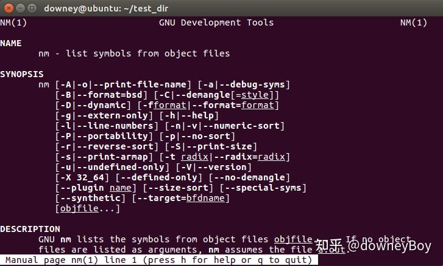

# linux下强大的文件分析工具 -- nm

 **Link:** [https://zhuanlan.zhihu.com/p/363014233]

## 什么是nm  

nm命令是linux下自带的特定文件分析工具，一般用来检查分析二进制文件、库文件、可执行文件中的符号表，返回二进制文件中各段的信息。 

  

### 目标文件、库文件、可执行文件  

首先，提到这三种文件，我们不得不提的就是gcc的编译流程：预编译，编译，汇编，链接。 

**目标文件** :常说的目标文件是我们的程序文件(.c/.cpp,.h)经过预编译，编译，汇编过程生成的二进制文件,不经过链接过程，下面的指令将生成对应的file.o文件,file.o即为二进制文件： 


```
    gcc(g++) -c file.c(file.cpp)
```
**库文件**： 分为静态库和动态库，这里不做过多介绍，库文件是由多个二进制文件打包而成，生成的.a文件，以下指令将test1.o test2.o test3.o三个文件打包成liba.a库文件： 


```
ar -rsc liba.a test1.o test2.o test3.o
```
**可执行文件**：可执行文件是由多个二进制文件或者库文件(由上所得，库文件其实是二进制文件的集合)经过链接过程生成的一个可执行文件，对应 windows 下的.exe文件，可执行文件中有且仅有一个main()函数，一般情况下，二进制文件和库文件中是不包含main()函数的，但是在linux下用户有绝对的自由，做一个包含main函数的库文件也是可以使用的,但这不属于常规操作，不作讨论。   


上述三种文件的格式都是二进制文件。 

## 为什么要用到nm  


在上述提到的三种文件中，用普通编辑器是无法查看其内容的，而使用二进制读写软件也只能查看原始的未格式化数据，所以当我们有debug，查看二进制文件格式的时候，这时候就将用到一些特殊工具，linux下的nm命令就可以完全胜任(同时还有objdump和readelf工具，这里暂不作讨论)。 

  

## 怎么使用nm  
如果你对linux下的各种概念还算了解的话，就该知道一般linux下的命令都会自带一些命令参数来满足各种应用需求，了解这些参数的使用是使用命令的开始。 

### man  

那么，如何去了解一个命令呢，最好的方法就是linux下的man命令，linux是一个宝库，而man指令就相当于这个宝库的说明书。 

用法：


```
man nm
```


  

这里面介绍了nm的各种参数以及详细用法，如果你有比较不错的英文水平和理解能力，可以直接参考man page中的内容。 

  

### nm的常用命令参数  


```
-A 或-o或 --print-file-name：打印出每个符号属于的文件
-a或--debug-syms：打印出所有符号，包括debug符号
-B：BSD码显示
-C或--demangle[=style]：对低级符号名称进行解码，C++文件需要添加
--no-demangle：不对低级符号名称进行解码，默认参数
-D 或--dynamic：显示动态符号而不显示普通符号，一般用于动态库
-f format或--format=format：显示的形式，默认为bsd，可选为sysv和posix
-g或--extern-only：仅显示外部符号
-h或--help：国际惯例，显示命令的帮助信息
-n或-v或--numeric-sort：显示的符号以地址排序，而不是名称排序
-p或--no-sort：不对显示内容进行排序
-P或--portability：使用POSIX.2标准
-V或--version：国际管理，查看版本
--defined-only：仅显示定义的符号，这个从英文翻译过来可能会有偏差，故贴上原文：

Display only defined symbols for each object file
```
### 示例讲解  

好了，上述就是常用的命令参数，光说不练假把式，下面将给出一个示例来进一步理解nm用法： 示例代码：


```
#include <iostream>
#include <string>

using namespace std;    
const char *str="downey";
int g_uninit;
int g_val=10;

void func1()
{
    int *val=new int;
    static int val_static=1;
    cout<<"downey"<<endl;
} 

void func1(char* str)
{
    cout<<str<<endl;
}

```
编译指令：


```
g++ -c test.cpp
nm -n -C test.o

```
在当前目录下生成 test.o 目标文件，然后使用nm命令解析，由于是 C++ 源文件，故添加 -C 选项，为了方便查看，添加 -n 选项。 

输出信息：


```
U __cxa_atexit
U __dso_handle
U std::ostream::operator<<(std::ostream& (*)(std::ostream&))
U std::ios_base::Init::Init()
U std::ios_base::Init::~Init()
U operator new(unsigned long)
U std::cout
U std::basic_ostream<char, std::char_traits<char> >& std::endl<char, std::char_traits<char> >(std::basic_ostream<char, std::char_traits<char> >&)
U std::basic_ostream<char, std::char_traits<char> >& std::operator<< <std::char_traits<char> >(std::basic_ostream<char, std::char_traits<char> >&, char const*)
0000000000000000    B g_uninit
0000000000000000    D str
0000000000000000    T func1()
0000000000000004    b std::__ioinit
0000000000000008    D g_val
000000000000000c    d func1()::val_static
0000000000000035    T func1(char*)
0000000000000062    t __static_initialization_and_destruction_0(int, int)
00000000000000a0    t _GLOBAL__sub_I_str
```
### nm输出内容解析  

下面我们再来解析输出信息中各部分所代表的意思： 

* 首先，前面那一串数字，指的就是地址，如果是二进制目标文件，指的就是逻辑地址，并非程序最后运行时的地址。
* 然后，我们发现，每一个条目前面还有一个字母，类似'U','B','D等等，其实这些符号代表的就是当前条目所对应的内存所在部分
* 最右边的就是对应的符号内容了

首要的需要讲解的就是第二点中字符所对应的含义，同样在还是在linux命令行下man nm指令可以得到：


```
A     ：符号的值是绝对值，不会被更改
B或b  ：未被初始化的全局数据，放在.bss段
D或d  ：已经初始化的全局数据
G或g  ：指被初始化的数据，特指small objects
I     ：另一个符号的间接参考
N     ：debugging 符号
p     ：位于堆栈展开部分
R或r  ：属于只读存储区
S或s  ：指为初始化的全局数据，特指small objects
T或t  ：代码段的数据，.test段
U     ：符号未定义
W或w  ：符号为弱符号，当系统有定义符号时，使用定义符号，当系统未定义符号且定义了弱符号时，使用弱符号。
？    ：unknown符号
```
根据以上的规则，我们就可以来分析上述的nm显示结果：

首先，输出的上半部分对应的符号全是U，跟我们常有思路不一致的是，这里的符号未定义并不代表这个符号是无法解析的，而是用来告诉链接器，这个符号对应的内容在我这个文件只有声明，没有具体实现。

如std::cout,std::string类，在链接的过程中，链接器需要到其他的文件中去找到它的实现，如果找不到实现，链接器就会报常见的错误：undefined reference。


关于这一部分的详解可参考[https://zhuanlan.zhihu.com/p/363010286](https://zhuanlan.zhihu.com/p/363010286) 。  


在接下来的三行中


```
 0000000000000000    B g_uninit 
 0000000000000000    D str 
 0000000000000000    T func1()
```
令人疑惑的是，为什么他们的地址都是0，难道说mcu的 0 地址同时可以存三种数据？

其实不是这样的，按照上面的符号表规则，g_uninit 属于.bss段，str 属于全局数据区，而func1() 属于代码段，这个地址其实是相对于不同数据区的起始地址，即 g_uninit 在.bss段中的地址是 0，以此类推，而 .bss 段具体被映射到哪一段地址，这属于平台相关，并不能完全确定。   
在目标文件中指定的地址都是逻辑地址，符号真正的地址需要到链接阶段时进行相应的重定位以确定最终的地址。 

在接下来的四行中


```
0000000000000004    b std::__ioinit 
0000000000000008    D g_val 
000000000000000c    d func1()::val_static 
0000000000000035    T func1(char*)
```
b在全局数据段中的 4 地址，因为上述 g_uninit 占用了四字节，所以 std::__ioinit 的地址为0+4=4. 

而g_val存在于全局数据段(D)中，起始地址为8，在程序定义中，因为在 0 地址处存放的是str指针,而我的电脑系统为64位，所以指针长度为8，则 g_val 的地址为0+8=8 

而静态变量val_static则是放在全局数据段8+sizeof(g_val)=12 处，函数 func1(char*) 则放在代码段 func1()后面

讲到这里，有些细心的朋友就会疑惑了，在全局数据区(D)中存放了str指针，那 str 指针指向的字符串放到哪里去了？其实这些字符串内容放在常量区，常量区属于代码区(text)(X86平台，不同平台可能有不同策略)，对应nm显示文件的这一部分： 


```
00000000000000a0    t _GLOBAL__sub_I_str 
```

如果你对此有一些疑惑，你可以尝试将 str 字符串放大，甚至是改成上千个字节的字符串，就会看到代码段(t)的变化。


