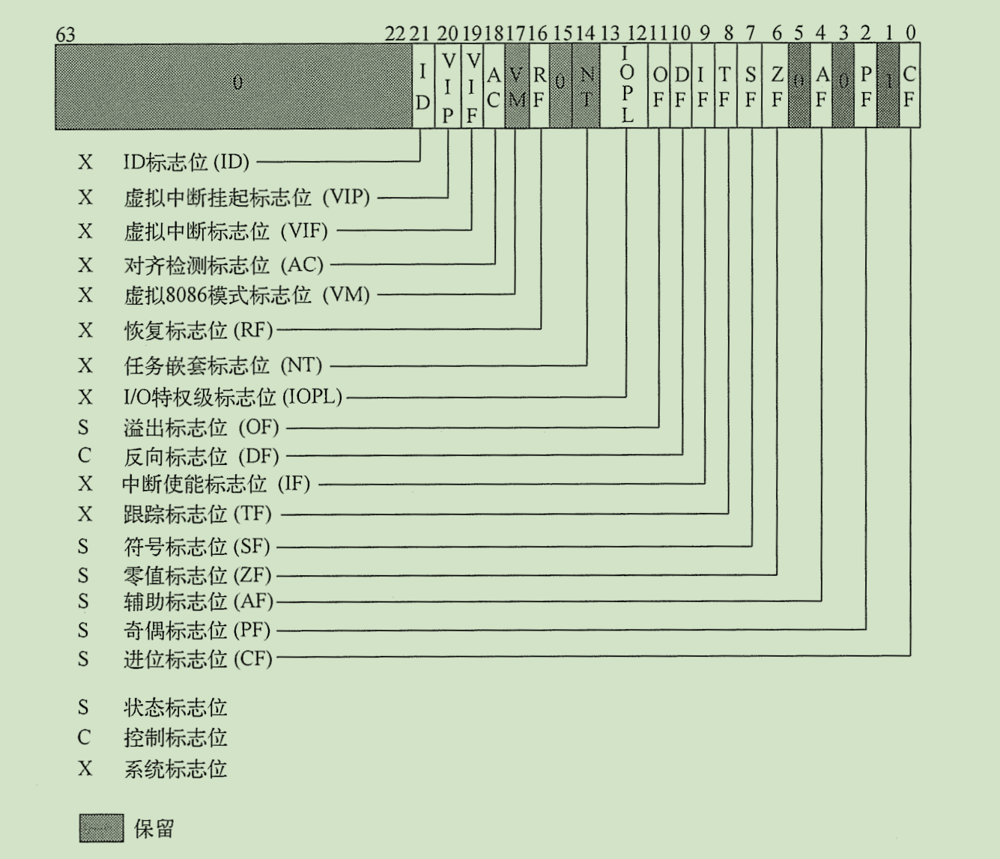
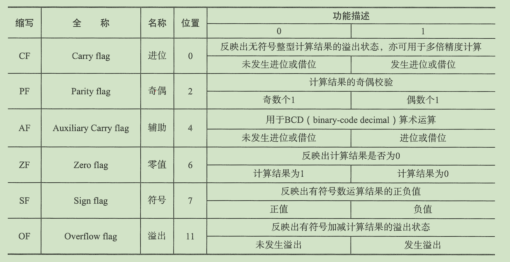
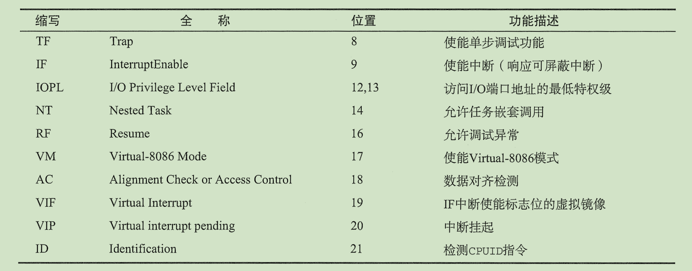
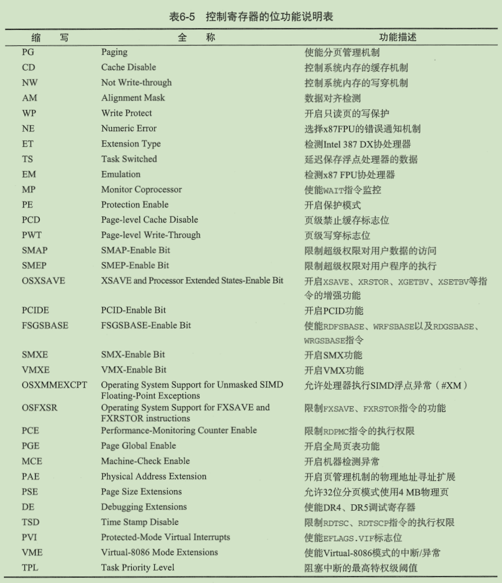
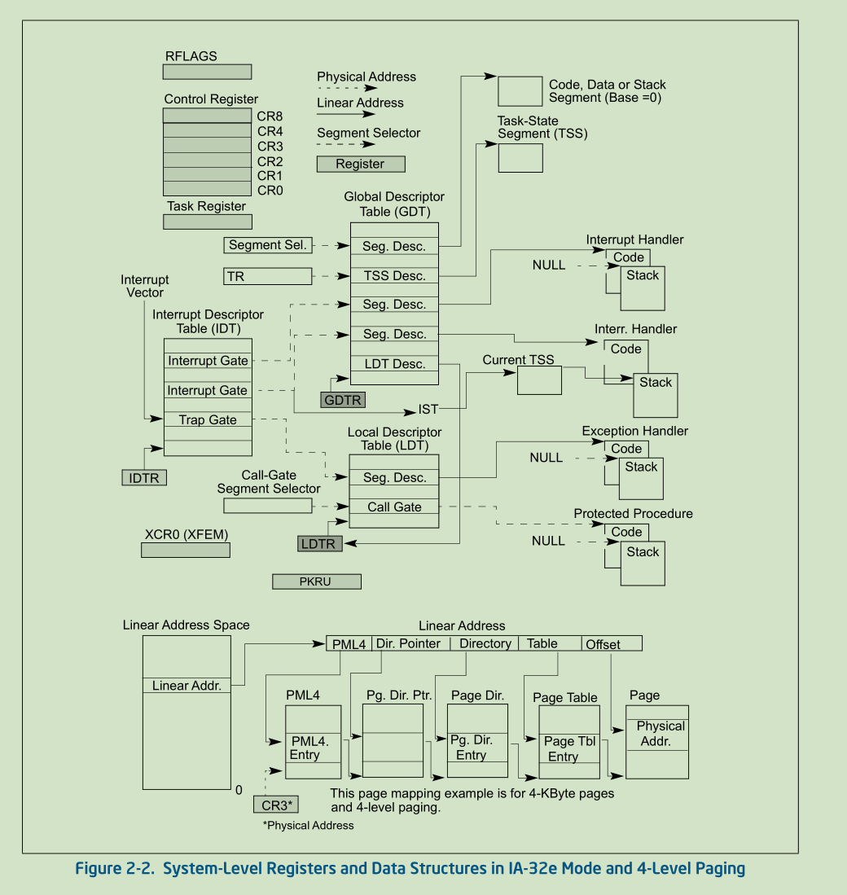
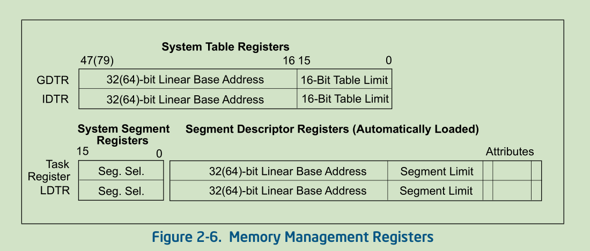
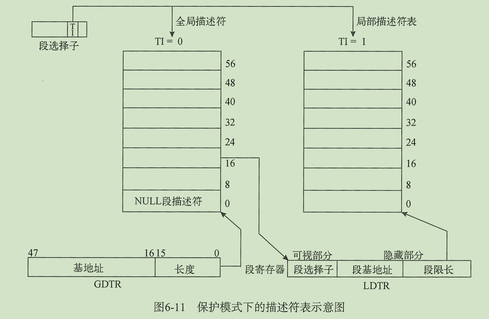
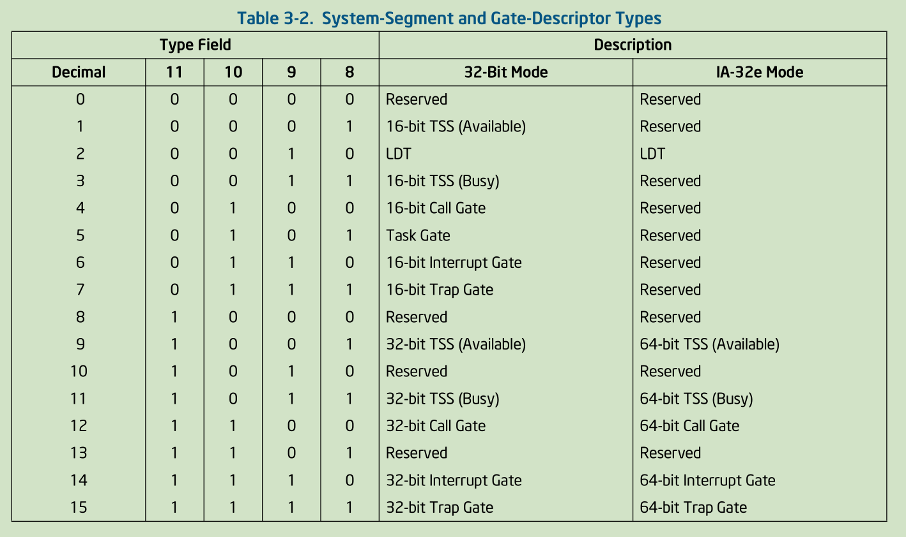
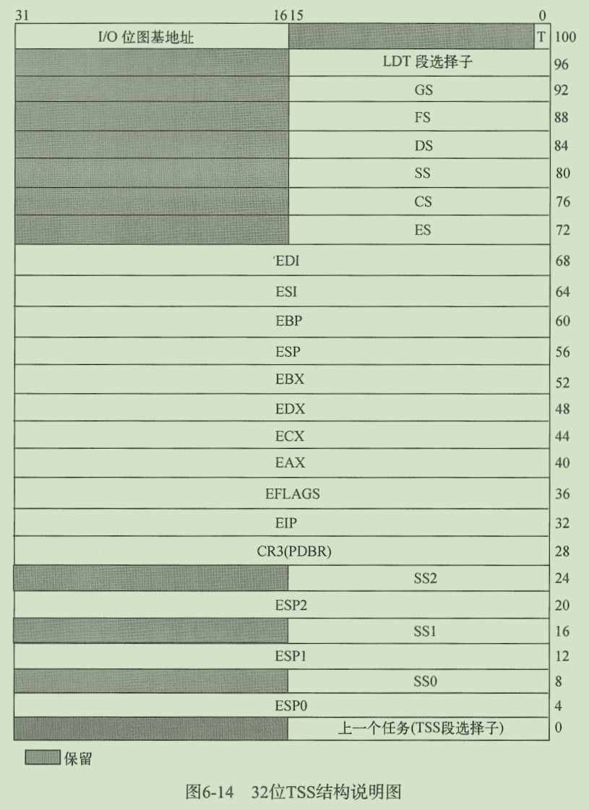

# 保护模式、实模式

[TOC]

## 处理器体系结构


32 位版的 x86 架构，最早实现在 Intel 推出的 80386 处理器上，此架构被称为 **IA-32** ( Intel Architecture 32bit )，也叫 i386。

64 位版的 x86 架构，最早由 AMD 率先设计实现，并称其为 AMD64。后来 Intel 也实现了这个指令集，但 Intel 显然不想用 AMD64 这个名, 所以另外起名，早期称之为 **IA-32e** 或 EM64T，后来称为 Intel64。


下面介绍都以 32 位 x86 的 IA-32 为基础。


### 1. 通用寄存器

IA-32 的通用寄存器有:

- EAX、EBX、ECX、EDX
- ESI、EDI、EBP、ESP、EIP
- ECS、EDS、ESS、EES

寄存器作用如下：

| 寄存器名称 |                          描述                           |
| :--------: | :-----------------------------------------------------: |
|  **EAX**   |        累加寄存器，用于累加操作，或保存计算结果         |
|  **EBX**   |     基址寄存器，作为 DS 数据段寄存器的段内偏移地址      |
|  **ECX**   |          计数寄存器，字符串和循环操作的计数器           |
|  **EDX**   |       数据寄存器，I/O地址指针、整数除法产生的余数       |
|            |                                                         |
|  **ESI**   |   源变址寄存器，作为 EDS 数据段寄存器的段内源地址指针   |
|  **EDI**   | 目的变址寄存器，作为 EES 数据段寄存器的段内目的地址指针 |
|  **EBP**   |   基址指针寄存器，栈帧，可用作 ESS 的一个相对基址位置   |
|  **ESP**   |                栈指针，指向目前栈顶位置                 |
|  **EIP**   |                     指令指针寄存器                      |
|            |                                                         |
|  **ECS**   |                      代码段寄存器                       |
|  **EDS**   |                      数据段寄存器                       |
|  **ESS**   |                      堆栈段寄存器                       |
|  **EES**   |                      附加段寄存器                       |


### 2. CPUID 指令

汇编指令 CPUID 用于鉴别处理器信息以及检测处理器支持的功能，在任何模式下的执行效果都相同。

通过 EFLAGS 标志寄存器的 ID 标志位（第21位）检测处理器是否支持 CPUID 指令。


CPUID 指令用法：

- 输入参数：EAX 作为主功能号（main-leaf），ECX 作为子功能号（sub-leaf）
- 结果：执行CPUID后，返回值将被写入 EAX，EBX，ECX 和 EDX 寄存器内


使用示例：

```assembly
section .data             ; NASM 汇编的 数据段
output:  db "The processor Vendor ID is 'xxxxxxxxxxxx'\n"       ; 最终打印的字符串格式，其中 xxx 表示要替换的字符

section .text             ; .text段中，_start作为程序的入口点，当然可以换成其他的名字
    global    _start      


_start:
    mov   eax,    0             ; 主功能 0，EAX=0：获取CPU的Vendor ID
    cpuid                       ; 调用 cpuid 指令

    mov   edi,    output        ; 将字符串首地址 放入 edi 基地址
    mov   [edi+28],    ebx      ; 通过基地址加偏移，放入替换的位置
    mov   [edi+32],    edx
    mov   [edi+36],    ecx

    mov   eax,     4            ; AX=4 表示 sys_write
    mov   ebx,     1            ; bx=1 表示 stdout
    mov   ecx,     output       ; cx 表示输出的内容
    mov   edx,     42           ; dx 表示字符串长度
    int   0x80                  ; 80 中断，系统调用

    mov   eax,     1            ; sys_exit
    mov   ebx,     0
    int   0x80                  ; 再次调用系统调用

```


编译：

```shell
nasm -f elf -g cpuid.asm -o cpuid.o
```

链接：

```shell
ld -m elf_i386 -g cpuid.o -o cpuid
```

执行：

```shell
❯ ./cpuid                                                                                              
The processor Vendor ID is 'GenuineIntel'
```


### 3. EFALGS 标志寄存器

EFLAGS 标志寄存器的位图如下所示：

- 下图位 RFLAGS 标志寄存器，64位操作系统已经将 EFLAGS 的 32 位扩展到 64 位，而 64 位模式已经不支持 VM 和 NT 标志位
- 其中第 1、3、5、15，以及 22~63 位保留使用




【问】：EFLAGS 标志寄存器有什么用呢？

【答】：有一些汇编指令，执行结果会直接修改标志寄存器的某些标志位，根据标志位的值来判断执行是否成功等。并且，当程序通过调用门执行任务切换时，处理器会把 EFLAGS 标志寄存器的内容存储到任务状态的 TSS 内，并将目标调用程序的 TSS 内容更新到 EFLAGS 标志寄存器内


#### 状态标志位

**状态标志位可以反映出汇编指令计算结果的状态**。

例如，ADD、SUB、DIV、MUL 等计算结果的奇偶性、溢出状态、正负值等。



注意：

- 以上状态标志位，只有 CF 标志位可通过 STC、CLC 和 CMC 等汇编指令修改

- 状态跳转指令 Jcc、状态字节位置指令 SETcc、状态循环指令 LOOPcc、状态移动指令 CMOVcc，都可以根据某个或几个状态标志位作为判断条件，进行相应操作


#### 方向标志位

**方向标志位 DF，控制着字符串指令的操作方向**，例如 MOVS、CMPS、SCAS、LODS、STOS等

- DF 置为 1，字符串按从高到低的地址方向（自减），通过 STD 汇编指令 置位
- DF 置为 0，字符串按从低到高的地址方向（自增），通过 CLD 汇编指令 复位


#### 系统标志位和LOPL区域


**EFLAGS中的系统标志位与IOPL区域位，负责控制 I/O 端口地址访问权限、屏蔽硬件中断请求、单步调试、任务嵌套、虚拟8086模式等**




注意：

- VIF 和 VIP 标志位只在虚拟8086模式（virtual-8086）模式中有效
- AC 标志位，只能对 3 特权级的数据进行对齐检测，如果未对齐，触发 #AC 异常
- RF 标志位，将临时禁止断点指令触发 #DB 异常
- IF 标志位，对NMI（NonMaskable Interrupt，不可屏蔽中断）不起作用


### 4. 控制寄存器

目前，Intel 处理器一共有 **6 个控制寄存器**，分别是 CR0、CR1、CR2、CR3、CR4 和 CR8，由若干标志位组成，这些标志位可以控制处理器的运行模式、开启扩展特性、以及记录异常状态等功能。


IA-32 体系结构中，控制寄存器的长度是 32 位，而在 IA-32e 体系结构(x86-64)中，控制寄存器的长度是 64 位。注意，<u>除了 地址类寄存器外，其他扩展位均保留使用，且必须置0，否则会触发 #GP 异常</u>。

下面是 64 位控制寄存器的位图：


下面是控制寄存器各个标志位的说明：



注意：

- CR0.CD 与 CR0.NW 联合控制着 处理器的缓存和读写策略，两者组合的策略如下：


- CR0.TS、CR0.EM 与 CR0.MP 标志位都用于控制浮点处理器(X87 FPU、MMX、SSE、SSE2 等)的执行动作。


## 地址空间

地址空间一般分为：

- 虚拟地址
- 逻辑地址


#### 虚拟地址

虚拟地址是抽象地址的统称。虚拟地址又分为逻辑地址、有效地址、线性地址和平坦地址

- **逻辑地址（Logical Address）**：段地址+段内偏移地址
    - 段内偏移地址 Offset，也叫做 有效地址，在高级语言中，指针地址就是有效地址
    - 逻辑地址最终都会转换为线性地址
- **线性地址（Linear Address）**：指虚拟地址到物理地址变换的中间层，是处理器可寻址的内存空间中的地址。是一串完整的平坦的中间地址。
    - 程序代码会产生逻辑地址，也就是段中的偏移地址，加上相应的段基址就成了线性地址。


#### 物理地址

物理地址是真实存在与硬件设备上的，通过处理器引脚直接或间接与外部设备、rom、ram相连接。在开启分页的情况下，线性地址需要经过页表映射才能转成成物理地址。

- I/O地址（I/O Address）：I/O 地址空间与内存地址空间相互隔离。
    - 必须借助 IN/OUT 指令访问。
    - I/O地址空间由 65536 个可独立寻址的 I/O 端口组成，寻址范围 0~FFFFh，其中 F8h~FFh 保留使用
- 内存地址（Memory Address）


## 实模式


实模式（Real Mode），采用独特的寻址方式进行地址访问，处理器在实模式下可直接访问物理地址。

早期CPU（如8086）是16位的CPU，寄存器是16位的，数据总线是16位的，也就是说在8086内部，能够一次性处理与传输的数据最长为16位比特，那么它的寻址能力仅为216=64 KB。但是地址总线却是20位的，即其寻址能力为220=1 MB。


**实模式的段寻址方式**：

实模式采用 `段基地址:段内偏移地址`，即 `Segment:Offset` 。其中 Segment 保存在段寄存器中，Offset 保存在寄存器或使用立即数代替。与线性地址转换公式为：
$$
Linear Address = Segment << 4 + Offset
$$
例如，段寄存器为 0xff00，段内偏移地址为 0x0110 ，那么线性地址为：0xff00 << 4 + 0x0110  = 0xff110


**实模式的中断向量表：**

实模式下，中断借助 中断向量表（Interrupt Vector Table，IVT） 将中断向量号与处理程序相关联。

实模式下的中断有硬件中断与软件中断（INT)两种，其实中断本质就是满足中断条件，转向某个地址执行，再返回原地址的下条指令的地址。中断地址也是基地址+偏移量构成的

IVT 有 256 项，每项占 4B，IVT 一共需要 1KB 的存储空间。

在计算机启动后，BIOS 会在物理地址 0 处创建中断向量表 IVT，如果希望在程序运行过程中修改或保存中断向量表，可借助 LIDT 和 SIDT 指令实现。


在实模式中整个物理内存被看成分段的区域，程序代码和数据位于不同区域，**系统程序和用户程序没有区别对待**，而且每一个指针都是指向「实在」的物理地址。这样一来，用户程序的一个指针如果指向了系统程序区域或其他用户程序区域，并改变了值，容易造成软件甚至系统崩溃。


## 保护模式

随着 CPU 的发展，CPU 的地址线的个数也从<u>原来的 20 根变为现在的 32 根</u>，所以可以访问的内存空间也从 1 MB 变为现在 4 GB，<u>寄存器的位数也变为 32 位</u>。因此，实模式下的内存地址计算方式就已经不再适用了，需要引入新的模式，即保护模式，实现更大空间的、更灵活的内存访问。

还有一点 ，<u>实模式中的程序是可以访问内存的任意位置的，程序的安全性无法得到保证</u>。


在保护模式下，全部 32 条地址线有效，可寻址高达 4 GB 的物理地址空间。扩充的存储器 **段式管理机制** 和可选的 **页式管理机制**，不仅为存储器共享和保护提供了硬件支持，而且为实现`虚拟存储器`提供了硬件支持，支持多任务，能够快速地进行任务切换和保护任务环境。四个特权级和完善的特权检查机制，既能实现资源共享又能保证代码和数据的安全及任务的隔离。


保护模式的全景示意图：




### 概念概述

1. **全局和局部描述符表**(GDT/LDT)
    1. 在保护模式下，所有的内存访问要么通过全局描述符表(GDT)，要么通过局部描述符表(LDT)。
    2. 描述符表中存放的是**段描述符(Segment Descriptor)**，内容包括段的基地址、访问特权、类型和用法信息。
    3. **每一个段描述符，都有一个相关的段选择子(Segment Selector)**
    4. 要访问段中的内容，必须同时提供段选择子和偏移地址，最终转化成线性地址。段描述符包括了线性地址空间的基地址，偏移量决定了相对于基地址的字节地址。
2. **系统段描述符、门**
    1. 除了代码段、数据和堆栈段是构成程序运行环境之外，系统架构还定义了两个**系统段**：TSS 和 LDT
    2. 系统架构还定义了一套称为**门**的描述符（<u>调用门、中断门、陷阱门、任务门</u>），这些门提供了一种访问运行在不同于应用程序的特权级的系统过程和处理程序的方法。
3. **任务状态段和任务门**
    1. **TSS定义了任务执行环境的状态**。这些状态包括通用寄存器、段寄存器、EFLAGS寄存器、EIP寄存器、段选择子、以及三个堆栈段(特权 0，1，2 各一个堆栈)的指针的状态，也包括与任务相关的 LDT 的选择符和页表基地址。（也就是任务运行所需要的一切状态）
    2. 在保护模式下运行的程序，都有一个**任务上下文**。<u>当前任务的 TSS 的段选择子保存在任务寄存器中</u>。切换到另一个任务最简单的方法就是 **CALL 或 JMP** 到新任务中。
    3. 在进行任务切换时，处理器按照下面步骤进行：
        1. 保存当前 TSS 中的任务状态
        2. 装载新任务段选择子的任务寄存器
        3. 通过 GDT 中段选择描述符访问新的 TSS
        4. 将新 TSS 中的状态装在到通用寄存器、段寄存器、LDTR、控制寄存器 CR3（页表基地址）、EFLAGS寄存器和EIP寄存器
        5. 开始执行新任务
4. **中断和异常处理**
    1. <u>外部中断、软件中断和异常是通过中断描述符表(IDT)处理的</u>
    2. IDT 包含了访问中断和异常处理成的门描述符表的集合，IDT 中门描述符包括有中断、陷阱、任务门类型。
    3. IDT 的线性基地址在 IDTR（IDT寄存器）。
    4. 在处理中断或异常处理程序时，处理器必须先从内部硬件、外部中断控制器、或通过 INT 、INTO、INT 3、BOUND 指令的软件中断，接到一个中断向量（中断数字）
5. **内存管理**
    1. 系统架构支持通过**分页**来实现虚拟内存，或者不分页，直接访问物理内存。
    2. 使用分页机制，一个线性地址被分为三个部分：页目录、页表、页中的偏移量。可以有多个页目录。
    3. 页保存在页目录和页表中
    4. 页目录包含有页表的物理地址、访问特权、内存管理信息
    5. 页表中包含有页的物理地址、访问特权、内存管理信息
    6. 页目录的基地址保存在控制寄存器 CR3 中


### 内存管理寄存器

<u>处理器提供了 4 个内存管理寄存器，分别是 GDTR、LDTR、IDTR、TR</u>。这些寄存器指明了控制分段内存的数据结构的位置。




#### 1. 全局描述符寄存器 - GDTR

**GDTR 寄存器保存了 <u>GDT 全局描述符表的 32 位基地址</u>和 <u>16 位表界限</u>**。也就是存放了 GDT 的位置信息

- 基地址是指 GDT 段的0字节线性首地址

- 表界限是指表中的字节个数


<u>LGDT 命令用户加载 GDTR 寄存器的内容。 SGDT 命令设置 GDTR 寄存器。</u>

 

处理器一上电，基地址被设为缺省的 0，表界限设置为 FFFFH。进入保护模式，新的基地址必须装入 GDTR。


#### 2. 局部描述符寄存器 - LDTR

**LDTR 寄存器保存了 <u>16 位段选择子</u>、<u>32 位基地址</u>、<u>16 位段界限</u>、<u>LDT 描述符属性</u>。**

- 基地址是指 LDT 段的0字节线性首地址
- 段界限是指段中的字节个数
- 段选择子和描述符属性随后介绍


LLDT 命令用户加载 LDTR 寄存器的段选择子部分内容。 SLDT 命令设置 LDTR 寄存器段选择子部分内容。

包含 LDT 的段必须在 GDT 中有段描述符。当 LLDT 指令在 LDTR 中加载段选择子时：LDT 描述符中的基地址、段界限和描述符属性会自动加载到 LDTR 中。当发生任务切换时，LDTR 会自动加载新任务的 LDT 的段选择子和描述符。 

处理器一上电，基地址被设为缺省的 0，段界限设置为 FFFFH。


#### 3. 中断描述符寄存器 - IDTR

**IDTR 寄存器保存了 IDT 的 <u>32 位基地址</u>和 <u>16 位表界限</u>。**

- 基地址是指 IDT 段的0字节线性首地址
- 表界限是指表中的字节个数


<u>LIDT 命令用户加载 IDTR 寄存器的内容。 SIDT 命令设置 IDTR 寄存器。</u>

处理器一上电，基地址被设为缺省的 0，表界限设置为 FFFFH。


#### 4. 任务寄存器 - TR

**TR 寄存器保存了 <u>16 位段选择子</u>、<u>32 位基地址</u>、<u>16 位段界限</u>、<u>当前任务的 TSS 描述符属性</u>。**

- 基地址是指 TSS 段的0字节线性首地址
- 段界限是指 TSS 中的字节个数
- 段选择子和描述符属性随后介绍


<u>LTR 命令用户加载 TR 寄存器的内容。 STR 命令设置 TR 寄存器。</u>


处理器一上电，基地址被设为缺省的 0，表界限设置为 FFFFH。


### 保护模式下的内存管理


 IA-32架构的内存管理机制主要分为两部分：**分段**和**分页**。 

- **分段**提供了一种隔绝各个代码、数据和堆栈区域的机制，保证了多个程序（或任务）可以运行在同一个处理器上，但不会相互干扰。
-  **分页**则为传统需求页的虚拟内存系统提供了一种实现机制，在虚拟内存系统中，程序运行所需的环境的各个部分<u>按需</u>映射到物理内存中。 分页同样可以为多个任务之间提供隔离措施。 

**在保护模式下，分段机制是必须的，分页机制是可选的。**


此篇只介绍分段，下一篇介绍分页。


段式管理提供了一种机制：其将处理器的**可寻址内存空间**（也被称为**线性地址空间**）划分为较小的受保护的地址空间区域，称为**段**


段可以用来装载**程序的代码、数据和堆栈**，也可用于装载**系统数据结构**（例如TSS或LDT）。 

- 如果一个处理器中有多个程序（或任务）正在运行，那么每个程序都会被分配自己的一组段空间。 
- 然后处理器可以加强这些段之间的界限，并且确保一个程序不会通过访问写入另一个程序的段而干扰另一个程序的运行。
- 分段机制还允许对段进行分类，这样一来便可限制对特定类型段所要执行的操作。


保护模式地址转换示意图：


- **逻辑地址**由一个**段选择子**和一个**偏移量**组成
    - **逻辑地址（Logical Address）**：一个逻辑地址由两部份组成，**段标识符**: **段内偏移量**。段标识符是由一个16位长的字段组成，称为**段选择子**（段选择子就是段标识符）
    - **线性地址（Linear Address）**：一个**段的基址**加上**段内偏移量**，形成线性地址空间中的一个线性地址。<u>线性地址是逻辑地址到物理地址变换之间的中间层</u>。这里段内偏移量就是逻辑地址中的段内偏移量。而段的基址跟逻辑地址中段标识符有关，通过段标识符（段选择子）可获得段描述符表中与该段选择子相关联的段描述符，段描述符提供了该段的基址。
    - **物理地址（Physical Address）**：物理内存中的地址。

- **段选择子**是一个段的**唯一标识**
- 每个段选择子指向在 GDT 或者 LDT 中提供了段描述表中的某一项。

-  每个段都有一个段描述符，它指定了段的大小、段的访问权限和特权级别、段的类型以及段的第一个字节在线性地址空间中的位置（即段基址)。
- 将逻辑地址的偏移量部分与段的基址相加，就可以定位段内的某个字节。 因此**基址加上偏移量**就形成了在处理器的线性地址空间中的一个**线性地址**。


**如果不启用分页，那么处理器的线性地址空间会被直接映射到处理器的物理地址空间。 物理地址空间定义为处理器可以在其地址总线上生成的地址范围**。


 分页机制支持建立一个**虚拟内存**环境，在这个环境中，可以<u>用小量的物理内存（RAM和ROM）和一些磁盘存储空间就可以模拟大容量的线性地址空间</u>。

启用分页机制时，每个段被划为分为页（通常每个页大小为4KB），这些页存储在物理内存或硬盘中。 

操作系统或程序通过维护一个页目录和一组页表来跟踪这些页。当程序（或任务）视图访问线性地址空间中的一个地址位置时，处理器便会使用页目录和页表将线性地址转换为一个物理地址，然后在该内存位置上执行所要求的操作（读或写）。

如果当前被访问的页面不在物理内存中，处理器便会<u>中断</u>当前程序的执行（通过产生一个页错误异常）。 然后，操作系统执行程序将从磁盘读取该页面进入物理内存，然后继续执行刚才被中断的程序。


#### 逻辑地址与线性地址

在保护模式下的系统架构，处理器分两步进行地址转换以得到物理地址：

- 逻辑地址转换机制
- 线性地址空间的分页机制

即使最小程度地使用分段，处理器地址空间中的每一个字节都需要使用逻辑地址访问。一个**逻辑地址**由**16位段选择符**和**32位偏移量**组成。


**<u>段选择子</u>标识该字节所位于的段，<u>偏移量</u>确定字节相对于段基址的段内位置。**

处理器将逻辑地址转换成线性地址的步骤如下：

1. 通过**段选择子中的偏移量**，来定位在GDT或LDT中对应的<u>段描述符</u>，然后读取到处理器中。（这步仅当一个新的段选择子被加载到段寄存器时才需要）。
2. 检查段描述符以检查**段的访问权限和段的地址范围**，以确保该**段是可访问**的，并且保证**段偏移在段限长范围**内。
3. 将**段描述符中的段的基址**与**段偏移量**相加，形成一个**线性地址**。


 如果不使用分页机制，处理器将会将线性地址直接映射为物理地址（也就是说，也就是说，线性地址可以直接送到处理器的地址总线，也就是说，线性地址等同于物理地址）。 如果线性地址空间被分页，启用分页机制，则会使用第二级地址转换来将线性地址转换为物理地址。


#### 段选择子（Segment Selectors）

 一个段选择子是一个**段的16位标识符**。段选择子不直接指向一个段，反而指向定义了一个段的段描述符，即段选择子是一个段描述符的索引。

段选择子功能位图如下所示：


- **Index**：索引（第3到15位），共13位，可从GDT或LDT中8192（ 2^13 ）个段描述符中选择一个。处理器将索引值乘以8（一个段描述符的大小为8字节），并将其与GDT或LDT的基址（分别来自GDTR或LDTR寄存器）相加可定位一个段描述符。
- **TI (table indicator)** ：表指示标志位（第2位），指示所使用段描述符表，当置0，表示选择GDT；当置1，表示选择LDT。
- **RPL(Requested Privilege Level )** ：请求特权级别（第0和第1位），共两位，指示该段选择子的权限级别。权限级别的范围为0到3，**权限级别0为最高权限级别**。


GDT的**第一个表项** 是不用的。 指向 GDT 第一个表项的段选择子（即索引值为0且 TI 标志设置为 0 的段选择子）称为**“空段选择符”**。

当空段选择符加载入段寄存器（除CS或SS寄存器（代码段寄存器、堆栈段寄存器）外）时，处理器不会产生异常。 然而，<u>当使用存储空段选择符的段寄存器访问内存时，它会产生一个异常</u>。 

空段选择符可以用于**初始化未使用的段寄存器**。 用空段选择器加载CS或SS寄存器会导致生成一个通用保护异常（#GP）。

段选择子作为指针变量的一部分对应用程序可见，段选择子的值通常由链接编辑器或链接加载器分配或修改，而不是应用程序。


#### 段寄存器（Segment Registers）

为了减少地址转换时间和降低编程复杂度，处理器提拱了至多可存储**6个段选择子的寄存器**。如下图：

- 每个段寄存器支持一种特定类型的内存引用（代码、堆栈或数据）。
- 对于执行任何类型的程序，至少要将**有效的段选择符**加载到**代码段（CS）、数据段（DS）和堆栈段（SS）**。
- 处理器还提供另外的数据段寄存器（ES、FS、GS），可用于让当前正在执行的程序（或任务）能够访问其他几个数据段。
-  对于访问一个段的一个程序，段选择器必须已经加载到一个段寄存器中。 因此，<u>尽管一个系统可以定义上千个段，但只有6个段可立即访问使用</u>。 在程序执行期间，通过将其他段的段选择子加载到这些寄存器中，就可以访问其他段


保护模式下的段寄存器共包含两个区域：

- **可见部分**
- **不可见部分**，也称为**“描述符缓存”**或**“影子寄存器”**


当一个段选择符被加载到段寄存器的可见部分时，处理器会同时将**段选择符所指向的段描述符的段基地址、段限长、 以及访问控制属性信息**加载到段寄存器的**不可见部分**；

<u>段选择符缓存在段寄存器中的信息（可见和不可见部分）使得处理器可以直接进行地址转换，而不需要再花费额外的总线周期从段描述符读取段的基址和段限长信息</u>。

在一个多处理器系统中，处理器都访问同一个描述符表，如果描述表被修改，则<u>软件应负责重新加载段寄存器</u>。 如果不重新加载，则可能出现段描述符已经被修改，却仍在使用缓存在段寄存器中的旧段描述符的清空。提供了以下两种方法来加载段寄存器：

- **直接载入指令**，如 MOV，POP，LDS，LES，LSS，LGS 和 LFS  等指令加载。这些指令明确指定了相应的段寄存器。
- **隐式载入指令**，如使用远指针的 CALL、JMP 和 RET 指令，还有 SYSENTER 和 SYSEXIT 指令，IRET、INTn，INTO 和 INT3 指令。这些指令执行时会附带修改CS寄存器的内容（有时也会修改其它寄存器的内容）。


#### 段描述符

**段描述符是GDT或LDT中的一个数据结构**，其<u>提供处理器中一个段的大小、位置、访问控制和状态信息</u>。段描述符通常由编译器、链接器、加载器或操作系统或执行程序创建，而不是应用程序创建。

**一个段描述符表是一个段描述符的数组**。段描述符表的长度不固定，可以最多包含 8192 个 8 字节的描述符。如下图所示：



- **全局描述符表（Global Descriptor Table，GDT）**：本身**不是一个段描述符**，**而是一个线性地址空间中的数据结构**。
    - 在使用 GDT 前，必须使用 LGDT 汇编指令将其线性基地址和长度加载到 GDTR 寄存器中。
    - 由于段描述符的长度为 8 字节（64 位），那么 GDT 的线性基地址按 8 字节边界对齐可使处理器的运行效果最佳
    - GDT 的长度为 8N-1 （N 是段描述符项数）
- **局部描述符表（Local Descriptor Table，LDT）**：是一个 **LDT 描述符类型的系统描述符类型的段描述符**，处理器必须使用 GDT 的一个段描述符来管理，也就是说，LDT 必须在 GDT 中。
    - 处理器使用 LLDT 指令可将 GDT 表内的 LDT 段描述符加载到 LDTR 寄存器中，随后处理器会自动完成加载伪描述符工作
    - LDT 段描述符可以保存在 GDT 的任何地方，如果系统支持多个 LDT 表，那么系统必须在 GDT 表中为每个 LDT 表创建独立的段描述符和段存储空间
    - 为了避免地址转换，LDTR 寄存器同样会保存 LDT 段描述符的段选择子、线性基地址、段限长、访问权限。

说明：

- 系统必须定义一个 GDT、以备所有的进程或者任务使用。

- 可以定义一个或者多个 LDT，例如，可以为每个正在运行的任务定义一个 LDT，也可以所有的任务共享一个 LDT。

- 处理器并不使用 GDT 中的第一个描述符（空描述符）。
    - 当指向这个空描述符的段选择子被装载如数据段寄存器（DS、ES、FS、GS）时，处理器不产生异常，但是，如果使用这个空描述符来访问内存，处理器会产生一个通用保护异常（GP） 
    - 使用指向空描述符的段选择子来初始化段寄存器，可以确保在不经意的引用到段寄存器时，处理器能够产生一个异常
    
    


段描述符位图功能如下图所示：


- **段基地址(Base address)**
    - 该字段定义了段的0字节在4GB大小的线性地址空间中的位置。 
    - 处理器将**三个基址字段**拼接在一起形成一个**32位长**的值。 
    - 段基址应按 16 字节边界进行对齐。 虽然 16 字节对齐不是必需的，但是通过把程序的代码和数据按 16 字节边界上对齐，可使得程序性能最佳。（即，边界对齐便于数据的访问）
- **段限长(Segment limit)**
    - 段限长字段，指明一个段的大小。
    - 处理器会把**两个段限长字段**拼接形成一个**20位长的值**。并<u>根据颗粒度标志位 G 的两种不同的值来解释段限长字段的含义</u>:
        - 若 G=0，段大小的范围为1B ~ 1MB 字节，单位为 1 字节。
        - 若 G=1，段大小的范围为4KB ~ 4GB 字节，单位为4KB字节。
    - 处理器通过两种不同方式使用段限长，其依据是段是**向上扩展段**还是**向下扩展段**：
        -  对于<u>向上扩展</u>的段，逻辑地址的段偏移量的范围为 **<u>0字节到段限长值</u>**。大于段限长的偏移量将会产生一个一般保护异常（#GP，所有段都会产生除了堆栈段外）或一个堆栈错误异常（#SS表示SS段） 。
        - 对于一个<u>向下扩展</u>段，则相反，段偏移量的范围为**<u>段限长 1 字节增长到0xFFFFFFFFH或0xFFFFH</u>**（这个取决于B标志位的设置）。小于或等于段限制的偏移量会产生一般保护异常或堆栈故障异常。<u>对于向下扩展段，减少段限长的值允许在段地址空间底部分配新的内存，而不是再顶部</u>。因为IA-32架构所使用的栈总是向下增长的，所以这种机制便于栈的扩展。
- **类型域(Type)**
    - 类型字段，指示**该段或门的类型**，并指明段的访问类型和段的扩展方向
    - 根据段描述符类型标志位 S，这个字段会有两种含义：
        - **应用程序（数据、代码）段描述符**
        - **系统段描述符**

- **S 描述符类型标志 (descriptor type)** 
    - 描述符类型标志位，其指明了一个段描述符是一个<u>系统段描述符（该标志位为 0）</u>，还是一个<u>代码或数据段描述符（该标志位为 1）</u>。

- **DPL 描述符特权级（descriptor privilege level ）**
    - 指明该段的特权级别。
    - 特权级别的取值范围为**0 -3**，**0是权限级别最高**。DPL用于控制对段的访问。
- **P 段存在标志 (segment-present)** 
    - 段存在标志位，指明段是否于内存中存在
        - P=1，在内存中
        - P＝0，不存在内存中
            - 若P＝0，当一个段描述符的段选择子加载进段寄存器时处理器会产生一个**段不存在异常 #NP**。
            - 内存管理软件可以使用此标志位来控制在某一给定时间将指定的段加载进物理内存中，这为管理虚拟内存提供了除分页以外的控制。
            - 在复位此标志后，操作系统可自由使用其他可用的段描述符区域
- **D/B 默认操作数大小/默认栈指针大小或上限(default operation size/default stack pointer size and/or upper bound)** 
    -  D/B（默认操作大小/默认栈指针大小和/或上界限）标志，用于表示代码段的操作数位宽，或者栈段的操作数位宽以及上边界
    - 其<u>根据段描述符描述的是一个可执行代码段、还是下扩数据段、或堆栈段来执行不同的功能</u>。（对于32位代码和数据段，该标志位应该总被设置为1；对于16位数据和代码段，该标志段被设置为0）。
        - **可执行代码段：**此时这个标志被称为**D标志位**，其指明段中的指令引用<u>有效地址和操作数的默认长度</u>。当D＝1，则默认值为32位地址和32位或8位操作数；当D＝0，则默认值为16位地址和16位或8 位操作数。指令前缀0x66H可用来选择非默认值的操作数大小；指令0x67H可用来选择非默认值的操作地址大小。
        - **堆栈段（由SS寄存器指向的数据段）：**此时这个标志被称为**B标志位**，它用于<u>指明隐含栈操作（如pushes、pops、calls）时的栈指针的大小</u>。当B＝1，则使用一个32位的栈指针，它存储在32位的ESP寄存器中；假如B=0，则使用一个16位的栈指针，它存储在16位的SP寄存器中。假如堆栈段被设置成一个下扩数据段，那么B标志也同时指定了堆栈段的上界限。
        - **向下扩展的数据段（Expand-downdata segment）**此时标志叫作**B标志**，它指明堆栈段的上界。当B=1,上界为0xFFFFFFFFH（4Gbytes）；当B＝0，上界为0xFFFFH（64KBytes）。

- **G 粒度标志 (granularity)** 
    - 颗粒度标志位G，其决定了段限长域字段的单位。
        - 当G＝0时，段限长的单位为字节；
        - 当G＝1时，段限长的单位为4KB
    - 这个标志位不会影响基地址的颗粒度，基地址的颗粒度总是字节单位。
    - 若设置了该标志位，则在使用段限长检查偏移量时，不会检查偏移量的12位最低有效位。 例如，当G=1时，段限长为 0 表明有效偏移量为0到4095。
- **L （64-bit code segment)** 
    - L标志位，在IA-32e模式下，段描述符第二个双字的第21位表示该代码段是否存储了本地64位代码。 
        - 当L=1时，表示在64位模式下执行该代码段中存储的指令。 
        - 当L=0时。表示在兼容模式下执行此代码段中存储的指令。 
    - 如果设置了L位，则必须复位D标志位。 当在非IA-32e模式或该段非代码段时，第21位是保留的，并且应该总是设置为0。

- **AVL 可用及保留的位(Available and reserved bits)** 
    - 可用和保留位，段描述符的第二个双字的第20位是保留给操作系统软件使用的


由于 Type 类型标志位与 S 描述符类型标志可指定多种描述符类型，下面逐一介绍描述符分类：

- 数据段和代码段描述符（Data and Code segment Descriptor）
- 系统描述符类型（SYSTEM DESCRIPTOR TYPES ）

##### 1. 数据段和代码段描述符（Data and Code segment Descriptor）

当段描述符中的**S标志位被设置**时，该描述符描述的是一个代码或数据段。类型字段（type）的**最高有效位**（第二个双字的第11位）用于决定是一个数据段（复位）还是一个代码段描（置位）。

- 当S=1，type的最高有效位为0时，该段描述符指向一个**数据段**；
- 当S=1，type的最高有效位为1时，该段描述符指向一个**代码段**。


**<u>对数据段</u>**：类型字段的低3位（第8、9、10位）的含义分别为<u>被访问accessed (A)、可写write-enable (W)和扩展方向 expand-direction (E)</u>

- E 标志位（Expansion-direction，扩展方向）：此标志为指示数据段的扩展方向，E=1 表示向下扩展，E=0 表示向上扩展
- W 标志位（Write-enable，可读写）：记录数据段的读写权限，W=1 可进行读写访问，W=0 只能进行读访问
- A 标志位（Accessed，已访问）：记录数据段是否被访问过，A=1 表示已访问，A=0 表示未访问。处理器只负责置位此标志，不负责复，只能借助程序手动复位。

数据段描述符的TYPE标志位组合示意如下：


**堆栈段**必须是一个**可读/写的数据段**。

- 若将不可写数据段的段选择子加载到 SS 寄存器中，则会导致产生一个一般保护异常。
- 如果堆栈段的长度会动态变化，那么堆栈段可以是一个**向下扩展的数据段**（扩展方向标志被设置）。因而，动态改变段限长的值将导致栈空间被添加到栈底部。 如果希望堆栈段的大小保持不变，则堆栈段可以是向上扩展或向下扩展类型。

 被访问位 A 指明该段自上次操作系统或执行程序复位**该位后是否被访问过**。

- 如果包含段描述符的内存类型支持**处理器写操作**，那么处理器每次将**段选择子加载到段寄存器**时都会设置这个位。 该位会一直保持被设置状态，直到其**显式复位**。 
- 该标志位既可以用于虚拟内存管理，也可以用于调试。


 **<u>对代码段</u>**，类型字段的低三位的含义（第8、9、10位）分别为**被访问accessed (A)、可读read enable (R)、 一致conforming (C)**。

- A 标志位（Accessed，已访问）：记录代码段是否被访问过，A=1 表示已访问，A=0 表示未访问。处理器只负责置位此标志，不负责复，只能借助程序手动复位。
- R 标志位（Readable，可读）：可执行程序虽然可以被处理器执行，但如果想读取程序段中的数据，就必须置位此标志。在**保护模式**下，**代码段是不可写**的。通过使用**带CS前缀的指令**或者把**代码段选择子**加载进一个**数据段寄存器**（DS、ES、FS或GS寄存器），就可读取代码段中的数据。
- C 标志位（Conforming，一致性）：代码段可以是**一致性和非一致性的**。
    - <u>操作系统允许执行在当前特权级的程序向一个**更高权级的一致性代码段**进行转移</u>。
    - 当向一个**不同特权级别**的**非一致性代码段**进行执行转移时，会产生一个通用保护异常（#GP），除非使用**调用门（call gate）或任务门（task gate）**（通过门，可以进行**跨权限级别的访问**）。
    - 一些系统工具（不访问保护设施）和一些处理某些异常类型（如除出错，溢出）的处理程序可以放在一致性代码段内。**需要保护其不能被更低特权级程序**访问的程序应该放在非一致性代码段内。
    - 所有的**数据段**都是**非一致性**的，这意味着它们不能**被更低特权级（权限数字值较大）的程序或过程访问**。
    - 与代码段不同的是，**数据段**总是能被**更高特权级（权限数字值较小，数字越小，权限越高）的程序或过程访问**，而不需要使用特别的访问门。


代码段描述符的TYPE标志位组合示意图如下：


##### 2. 系统描述符类型（SYSTEM DESCRIPTOR TYPES ）

当段描述符中的**S标志位（描述符类型）被复位(置0)**时，表明该段描述符为一个**系统描述符**。处理器能识别以下一些类型的系统段描述符：

- **局部描述符表(LDT)的段描述符**
- **任务状态段(TSS)描述符**
- **调用门描述符**
- **中断门描述符**
- **陷阱门描述符**
- **任务门描述符**

这些描述符可分为两大类：

- **系统段描述符**：系统段描述符指向一个系统段（LDT或TSS段）
    - **门描述符**：门描述符存储了代码段中指向程序入口点的指针（调用、中断和陷阱门），或者存储了TSS的段选择符（任务门）


系统段描述符的TYPE标志位组合示意图如下：




###### LDT 段描述符

LDT 段描述符用于记录 LDT 表的位置、长度、访问权限等信息，位功能与 TSS 描述符相同。

LDT 可在各程序或任务之间起到隔离作用。操作系统使用其他方法同样可以起到程序的隔离作用，例如为每个任务创建独立的页表结构。


###### TSS 描述符

TSS 用户保存任务的处理器状态信息。

和其他描述符一样，处理器需要借助 TSS 描述符才能对任务状态进行访问和管理。下图是 TSS 描述符的位功能：


TSS 描述符的位功能与其他段描述描述的格式基本相同。

<u>这里主要说明 B（Busy） 标志位。B 标志位指示任务是否处于忙状态，一个处于忙状态的任务表明它正在运行或已经挂起</u>。


**TSS 描述符只能保存在 GDT 中，不可存放于 LDT 或 IDT 中**。

任务寄存器（Task Register，TR）与 LDTR 寄存器的结构类似。TR 任务寄存器保存的是 TSS 段选择子以及 TSS 描述符信息。

- 试图将 TSS 段选择子加载到段寄存器都将触发 #GP 异常；
- 访问一个 TI 标志位被置位的 TSS 段选择子都将触发 #GP 异常（使用 CALL 或 JMP 指令）或 #TS 异常（使用 IRET 指令）


TSS 段只要用于任务切换（或特权级切换）时，保存处理器的寄存器状态，以及切换至对应特权级栈空间，从而使得任务返回时能够还原执行现场。


下图时 32 位任务状态内存段的内部结构，保存各个寄存器的状态。



任务状态段（Task-State Segment(TSS)），保存任务状态信息的系统段为任务状态段。TSS主要分为动态区域和静态区域。


当任务在切换过程中挂起时，处理器将执行限长保存在动态区域内。

下面是 TSS 的动态区域：


当任务在切换过程中挂起时，处理器只会读取静态区域的数据，并不会更新静态区域内的数值。

此处的栈空间是静态的，它不会因任务切换而发生改变，但 SS 和 ESP 寄存器值将会随着任务的切换而被更新。


对于处理器级的任务，只能在满足以下四种条件之一才会发生：

- 当前程序通过 JMP 或 CALL 指令跳转至 GDT 中的 TSS 描述符时，任务切换将会发生。
- 当前程序通过 JMP 或 CALL 指令跳转至 GDT 或 LDT 中的任务门段描述时，任务切换将会发生。
- 如果一个 IDT 表项使用任务门描述符来保存中断或异常处理程序，那么在触发中断或异常时，任务切换将会发生。
- 如果当前任务的 EFLAGS.NT 标志位被置位，那么在执行 IRET 指令时任务切换将会发生。

除了上述 4 种硬件级任务切换方法，程序还可以使用软件逻辑实现切换。例如采用独立页表空间切换方式。通过切换页表以及 JMP 指令来切换任务。


###### 调用门描述符

调用门可以让不同特权级间的程序实现受控切换，通常用于收特权级保护的操作系统或成程序。

下面时调用门描述符的位功能说明：


调用门的一个显著特点时借助 CALL 指令穿过调用门可访问更高特权级（CPL >= DPL）的代码段，如果目标代码段是非一致的，则栈切换会发生。（一致性代码段不会改变 CS 寄存器的 CPL 值）在发生特权级切换时，必定伴随着栈切换，而且栈特权级将与 CPL  特权级保持一致。

JMP 指令只能穿过相同特权级（CPL = DPL）的非一致性代码段，但 CALL 与 JMP 指令却都可以访问更高特权级的一致性代码段。


###### 陷阱门、中断门、任务门描述符

中断部分再介绍


