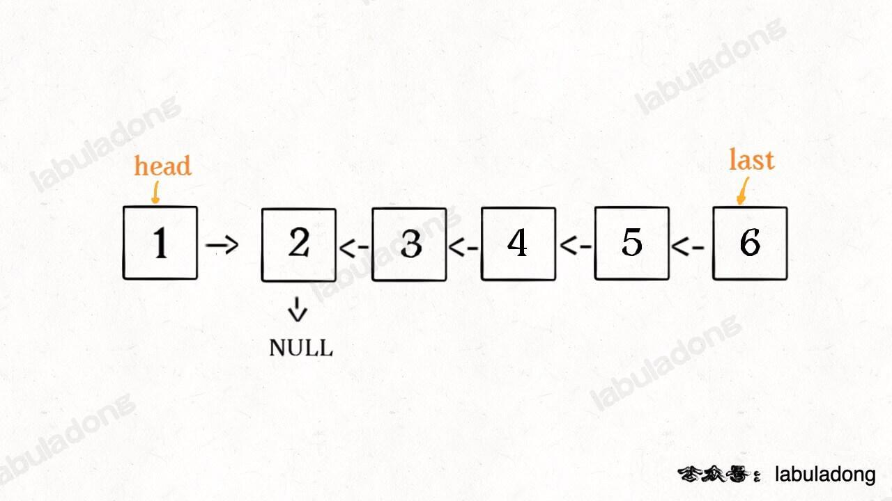
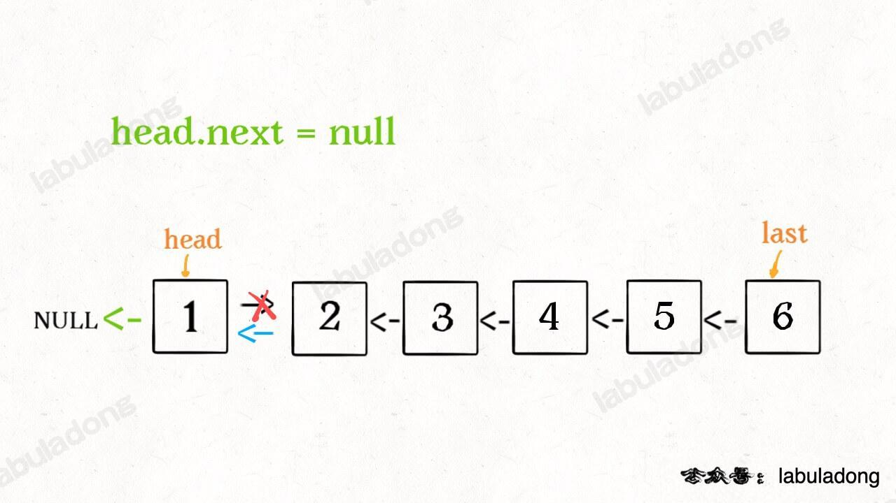

# 链表双指针/递归全解

[toc]


单链表用到了双指针技巧的所有题目类型：

1. 合并两个有序链表

2. 单链表的分解
3. 合并 `k` 个有序链表
4. 寻找单链表的倒数第 `k` 个节点
5. 寻找单链表的中点
6. 判断单链表是否包含环并找出环起点
7. 判断两个单链表是否相交并找出交点


单链表递归的问题：

- 反转单链表


## 双指针问题


### 1、合并两个有序链表

给你输入两个有序链表，请你把他俩合并成一个新的有序链表


模板：

```python
def mergeTwoLists(l1: ListNode, l2: ListNode) -> ListNode:
    # 虚拟头结点
    dummy = ListNode(-1)
    p = dummy
    p1 = l1
    p2 = l2

    while p1 and p2: 
        # 比较 p1 和 p2 两个指针
        # 将值较小的的节点接到 p 指针
        if p1.val > p2.val:
            p.next = p2
            p2 = p2.next
        else:
            p.next = p1
            p1 = p1.next
        # p 指针不断前进
        p = p.next

    if p1:
        p.next = p1

    if p2:
        p.next = p2

    return dummy.next

```


**重要：**

**代码中还用到一个链表的算法题中是很常见的「虚拟头结点」技巧，也就是 `dummy` 节点**。

- **当你需要创造一条新链表的时候，可以使用虚拟头结点简化边界情况的处理**。
- 比如说，让你把两条有序链表合并成一条新的有序链表，是不是要创造一条新链表？再比如你想把一条链表分解成两条链表，是不是也在创造新链表？这些情况都可以使用虚拟头结点简化边界情况的处理。


### 2、单链表的分解

给你一个无序链表，在给定一个值 x，要求对链表进行分隔，使得：

- 小于等于 x 的节点，出现在 大于或等于 x 的节点之前。


思路就是：

- 小于等于 x 的节点，放入一个单链表 head1 中
- 大于等于 x 的节点，放入另一个单链表 head2 中
- 最后，合并两个单链表 head1 和 head2


算法模板：

```python
    def partition(self, head: Optional[ListNode], x: int) -> Optional[ListNode]:
        # 初始化两个单链表的头节点
        head1 = ListNode()			# 存放小于 x 的链表的虚拟头结点
        head2 = ListNode()			# 存放大于等于 x 的链表的虚拟头结点
        
        # p1, p2 指针负责生成结果链表
        p1, p2 = head1, head2
        # p 负责遍历原链表
        p = head
        
        while p:
            # 判断原链表中当前节点应该在 head1 和 head2 哪个链表中
            if p.val < x:
                p1.next = p
                p1 = p1.next
            else:
                p2.next = p
                p2 = p2.next
            p = p.next			# 原链表指针继续前进
        
        # 最后，p2 指针就是 head2 的尾指针，需要将 next 置为 None
        p2.next = None
        # p1 就是 head1 的尾指针，但是需要将 head1 和 head2 连接，因此 p1 的 next  就是 head2 的 next
        p1.next = head2.next
        return head1.next
```


### 3、合并 k 个有序链表


给你一个链表数组，每个链表都已经按升序排列。

请你将所有链表合并到一个升序链表中，返回合并后的链表。


思路就是：

- 初始化一个新的链表头节点 head
- 每次取到所有链表中的最小值，放入 head 链表
- 怎么取到最小值呢？可以使用优先队列（也就是最大/最小堆）
    - 先将所有的链表的头节点放入优先队列
    - 如果优先队列中有数据，则一直遍历：
        - 取出最小节点，放入结果 head 链表
        - 如果取出的节点，有 next 的节点，继续放入 优先队列进行排序

算法模板：(heapq 是优先队列的实现库)

```python
import heapq
def mergeKLists(lists: List[ListNode]) -> ListNode：
    """
    :type lists: List[ListNode]
    :rtype: ListNode
    """
    if not lists:
        return None
	# 结果的虚拟头节点
    head = ListNode()
    p = head
    # 优先队列
    priority_queue = []

    # 先将所有队列的头节点放入优先队列
    # 按照 val 进行优先级排序，存储的数据是元组(val, ListNode)
    for item in lists:
        if item:
            heapq.heappush(priority_queue, (item.val, item))

    # 遍历优先队列
    while priority_queue:
        # 取出优先队列中的最小节点
        node = heapq.heappop(priority_queue)[1]
        
        # 如果 该节点还有下一级节点，继续添加到优先级队列
        if node.next:
            heapq.heappush(priority_queue, (node.next.val, node.next))
        # 将当前最小节点放入到 head 链表，p 指针继续前进
        p.next = node
        p = p.next
    return head.next
```


时间复杂度：

优先队列 `priority_queue` 中的元素个数最多是 `k`，所以一次 `poll` 或者 `add` 方法的时间复杂度是 `O(logk)`；所有的链表节点都会被加入和弹出 `pq`，**所以算法整体的时间复杂度是 `O(Nlogk)`，其中 `k` 是链表的条数，`N` 是这些链表的节点总数**。


### 4、寻找单链表的倒数第 `k` 个节点


从前往后寻找单链表的第 `k` 个节点很简单，一个 for 循环遍历过去就找到了，但是如何寻找从后往前数的第 `k` 个节点呢？

那你可能说，假设链表有 `n` 个节点，倒数第 `k` 个节点就是正数第 `n - k + 1` 个节点，不也是一个 for 循环的事儿吗？

是的，但是算法题一般只给你一个 `ListNode` 头结点代表一条单链表，你不能直接得出这条链表的长度 `n`，而需要先遍历一遍链表算出 `n` 的值，然后再遍历链表计算第 `n - k + 1` 个节点。

也就是说，这个解法需要遍历两次链表才能得到出倒数第 `k` 个节点。

那么，我们能不能**只遍历一次链表**，就算出倒数第 `k` 个节点？可以做到的，如果是面试问到这道题，面试官肯定也是希望你给出只需遍历一次链表的解法。


目的：寻找单链表倒数第 k 个节点

思路：
```shell
# 假设链表长度为 n （未知）
  a -> b -> c -> d -> e -> f -> g -> None
head
# 1. 先让 p1 指针指向链表头节点，然后走 k 步
# 现在的 p1，只要再走 n - k 步，就能走到链表末尾的空指针
  |-     k    -| p1 |-     n-k         -|
  a -> b -> c -> d -> e -> f -> g -> None
head

# 2. 在这个时候，让 p2 指针指向链表头节点，
  |-     k    -| p1 |-     n-k         -|
  a -> b -> c -> d -> e -> f -> g -> None
 p2  


# 3.  p1 和 p2 同时向前走，p1 走到链表末尾的空指针时前进了 n - k 步，p2 也从 head 开始前进了 n - k 步，停留在第 n - k + 1 个节点上，即恰好停链表的倒数第 k 个节点上：

                   (n-k+1)           p1  
  a -> b -> c -> d -> e -> f -> g -> None
  |-     n-k       -| p2 |-  n-k -| 
```


上述路基很巧妙，只需要遍历一遍链表，就可以找到 n-k+1 ，也就是倒数第 k 个节点。


算法模板：

```python
# 返回链表的倒数第 k 个节点
def findFromEnd(head: ListNode, k: int) -> ListNode:
    p1 = head
    # p1 先走 k 步
    for _ in range(k):
        p1 = p1.next
    p2 = head
    # p1 和 p2 同时走 n - k 步
    while p1 != None:
        p2 = p2.next
        p1 = p1.next
    # p2 现在指向第 n - k + 1 个节点，即倒数第 k 个节点
    return p2
```


这里注意一点技巧，如果要删除倒数第 k 个节点：

- 需要考虑链表只有一个节点的情况
- 可以使用虚拟头节点，`dummy = ListNode()`, 然后将 原链表的头节点挂在其后，`dummy.next = head`
- 利用上面的方法，找到倒数第 k+1 个，也就是要删除的前一个，这样可以删除
- 虚拟头节点可以保证只有一个节点的情况，可以删除


例如，删除倒数第 n 个节点：

```python
class Solution:
    def removeNthFromEnd(self, head: Optional[ListNode], n: int) -> Optional[ListNode]:
        # 虚拟头节点
        dummy_head = ListNode()
        dummy_head.next = head
        # 找到倒数第 n+1 个，要删除的前一个
        pre_node = self.findFromEnd(dummy_head, n+1)
		# 删除倒数第 n 个节点
        # 如果原链表只有一个节点，要删除倒数第一个，那么这里返回的就是倒数第一个的前一个，也就是 虚拟头节点
        pre_node.next = pre_node.next.next
        return dummy_head.next

    def findFromEnd(self, head: Optional[ListNode], n: int) -> ListNode:
        p1 = head
        for _ in range(n):
            p1 = p1.next
        
        p2 = head
        while p1 is not None:
            p1 = p1.next
            p2 = p2.next
        
        return p2
```


不过注意我们又使用了虚拟头结点的技巧，也是为了防止出现空指针的情况，比如说链表总共有 5 个节点，题目就让你删除倒数第 5 个节点，也就是第一个节点，那按照算法逻辑，应该首先找到倒数第 6 个节点。但第一个节点前面已经没有节点了，这就会出错

### 5、单链表的中点


寻找链表的中点，问题的关键也在于我们无法直接得到单链表的长度 `n`，常规方法也是先遍历链表计算 `n`，再遍历一次得到第 `n / 2` 个节点，也就是中间节点。


与上面的快慢指针类似，我们让两个指针 `slow` 和 `fast` 分别指向链表头结点 `head`。

**每当慢指针 `slow` 前进一步，快指针 `fast` 就前进两步，这样，当 `fast` 走到链表末尾时，`slow` 就指向了链表中点**。


算法模板：
```python
def middleNode(head: Optional[ListNode]) -> Optional[ListNode]:
    fast, slow = head, head
    while fast is not None and fast.next is not None:
        fast = fast.next.next
        slow = slow.next

    return slow
```


### 6、判断链表是否包含环

### 判断单链表是否有环

判断链表是否包含环属于经典问题了，解决方案也是用快慢指针：

每当慢指针 `slow` 前进一步，快指针 `fast` 就前进两步。

- 如果 `fast` 最终遇到空指针，说明链表中没有环；
- 如果 `fast` 最终和 `slow` 相遇，那肯定是 `fast` 超过了 `slow` 一圈，说明链表中含有环


算法模板：

```python
def hasCycle(head: ListNode) -> bool:
    # 快慢指针初始化指向 head
    slow, fast = head, head
    # 快指针走到末尾时停止
    while fast and fast.next:
        # 慢指针走一步，快指针走两步
        slow = slow.next
        fast = fast.next.next
        # 快慢指针相遇，说明含有环
        if slow == fast:
            return True
    # 不包含环
    return False
```


### 如何找到单链表中环的起点

什么是环的起点呢？


寻找环的起点，与判断是否有环是相同的做法，同样使用快慢指针，算法一句话概括：

**当快慢指针相遇时，让其中任一个指针指向头节点，然后让它俩以相同速度前进，再次相遇时所在的节点位置就是环开始的位置。**


原理：

假设快慢指针相遇时，慢指针 `slow` 走了 `k` 步，那么快指针 `fast` 一定走了 `2k` 步：


`fast` 一定比 `slow` 多走了 `k` 步，这多走的 `k` 步其实就是 `fast` 指针在环里转圈圈，所以 `k` 的值就是环长度的「整数倍」。

假设相遇点距环的起点的距离为 `m`，那么结合上图的 `slow` 指针，环的起点距头结点 `head` 的距离为 `k - m`，也就是说如果从 `head` 前进 `k - m` 步就能到达环起点。

巧的是，如果从相遇点继续前进 `k - m` 步，也恰好到达环起点。因为结合上图的 `fast` 指针，从相遇点开始走k步可以转回到相遇点，那走 `k - m` 步肯定就走到环起点了：


所以，只要我们把快慢指针中的任一个重新指向 `head`，然后两个指针同速前进，`k - m` 步后一定会相遇，相遇之处就是环的起点了。


算法模板：

```python
def detectCycle(head: ListNode) -> ListNode:
    # 快慢指针
    fast, slow = head, head
    # fast 两步，slow 一步
    # 找到第一次相遇的地方，则判断为有环
    while fast and fast.next:
        fast = fast.next.next
        slow = slow.next
        if fast == slow:
            break 
    # 如果没环，直接返回
    if not fast or not fast.next:
        return None
    
    # 让慢指针回到头指针
    slow = head 
    # 快慢指针相同步长，一次一步，直到相遇
    while slow != fast:
        fast = fast.next
        slow = slow.next
    # 相遇点就是环的起点
    return slow
```


### 7、两个链表是否相交

给你输入两个链表的头结点 `headA` 和 `headB`，这两个链表可能存在相交。

如果相交，你的算法应该返回相交的那个节点；如果没相交，则返回 null。

比如题目给我们举的例子，如果输入的两个链表如下图：


直接的想法可能是用 `HashSet` 记录一个链表的所有节点，然后和另一条链表对比，但这就需要额外的空间。

如果不用额外的空间，只使用两个指针，你如何做呢？


难点在于，由于两条链表的长度可能不同，两条链表之间的节点无法对应：

如果计算出两个链表的长度，那可以从相对应的节点开始比对。


如果不计算长度，用两个指针 `p1` 和 `p2` 分别在两条链表上前进，并不能**同时**走到公共节点，也就无法得到相交节点 `c1`。

**解决这个问题的关键是，通过某些方式，让 `p1` 和 `p2` 能够同时到达相交节点 `c1`**。

所以，我们<u>可以让 `p1` 遍历完链表 `A` 之后开始遍历链表 `B`，让 `p2` 遍历完链表 `B` 之后开始遍历链表 `A`，这样相当于「逻辑上」两条链表接在了一起。</u>

如果这样进行拼接，就可以让 `p1` 和 `p2` 同时进入公共部分，也就是同时到达相交节点 `c1`：


那你可能会问，如果说两个链表没有相交点，是否能够正确的返回 null 呢？

这个逻辑可以覆盖这种情况的，相当于 `c1` 节点是 null 空指针嘛，可以正确返回 null。

按照这个思路，可以写出如下代码：

```python
class ListNode:
    def __init__(self, val=0, next=None):
        self.val = val
        self.next = next

def getIntersectionNode(headA: ListNode, headB: ListNode) -> ListNode:
    # p1 指向 A 链表头结点，p2 指向 B 链表头结点
    p1, p2 = headA, headB
    while p1 != p2:
        # p1 走一步，如果走到 A 链表末尾，转到 B 链表
        if p1 is None:
            p1 = headB
        else:
            p1 = p1.next
        # p2 走一步，如果走到 B 链表末尾，转到 A 链表
        if p2 is None:
            p2 = headA
        else:
            p2 = p2.next
    return p1
```


## 递归问题

### 1. 递归反转整个链表

将一个单链表反转，通过递归的方法，来明确递归的思想。


直接看反转整个单链表的模板实现：

```python
# 定义：输入一个单链表头节点，将该链表反转，返回新的头结点
def reverse(head: ListNode) -> ListNode:
    # base case, 什么时候是最后一个递归
    if not head or not head.next:
        return head
    last = reverse(head.next)
    # 递归后操作
    head.next.next = head 
    head.next = None 
    return last

```

**对于递归算法，最重要的就是明确递归函数的定义**。具体来说，我们的 `reverse` 函数定义是这样的：

**输入一个节点 `head`，将「以 `head` 为起点」的链表反转，并返回反转之后的头结点**。


理解过程：

1. 链表初始化为：


2. 递归过程：`last = reverse(head.next)`，不要跳进递归（你的脑袋能压几个栈呀？），而是要根据刚才的函数定义，来弄清楚这段代码会产生什么结果：


3. 某一个递归 `last = reverse(head.next)` 过程执行完成后，整个链表就成了这样：
    - 并且根据函数定义，`reverse` 函数会返回反转之后的头结点，用变量 `last` 接收了。



4. 接下来，子问题已经反转完成，返回了反转后的头节点，也就是 last，完成当前问题剩余的步骤1：`head.next.next = head`


5. 完成当前问题剩余的步骤2: `head.next = None`




总结，递归的思想：

1. 递归函数要有 base case，也就是这句：
    - 意思是如果链表为空或者只有一个节点的时候，反转结果就是它自己，直接返回即可。

```python
if not head or not head.next:
    return head
```


2. 当链表递归反转之后，新的头结点是 `last`，而之前的 `head` 变成了最后一个节点，别忘了链表的末尾要指向 null：

- 理解了这两点后，我们就可以进一步深入了，接下来的问题其实都是在这个算法上的扩展。

```python
last = reverse(head.next) 
head.next.next = head 
head.next = None 
return last
```


### 2. 反转链表前 N 个节点


解决思路和反转整个链表差不多，只要稍加修改即可：

```python
successor = None # 后继节点

# 反转以 head 为起点的 n 个节点，返回新的头节点
def reverseN(head: ListNode, n: int) -> ListNode:
    global successor
    if n == 1:
        # 记录第 n + 1 个节点
        successor = head.next
        return head
    # 以 head.next 为起点，需要反转前 n - 1 个节点
    last = reverseN(head.next, n - 1)

    head.next.next = head
    # 让反转之后的 head 节点和后面的节点连起来
    head.next = successor
    return last 

```

具体的区别：

1、base case 变为 `n == 1`，反转一个元素，就是它本身，同时**要记录后驱节点**。

2、刚才我们直接把 `head.next` 设置为 null，因为整个链表反转后原来的 `head` 变成了整个链表的最后一个节点。但现在 `head` 节点在递归反转之后不一定是最后一个节点了，所以要记录后驱 `successor`（第 `n + 1` 个节点），反转之后将 `head` 连接上。


### 3. 反转链表的一部分

给一个索引区间 `[m, n]`（索引从 1 开始），仅仅反转区间中的链表元素。

首先，如果 `m == 1`，就相当于反转链表开头的 `n` 个元素嘛，也就是我们刚才实现的功能：

```python
def reverseBetween(head: ListNode, m: int, n: int) -> ListNode:
    if m == 1:
        # 相当于反转前 n 个元素
        return reverseN(head, n)
    # ...
```

如果 `m != 1` 怎么办？如果我们把 `head` 的索引视为 1，那么我们是想从第 `m` 个元素开始反转对吧；如果把 `head.next` 的索引视为 1 呢？那么相对于 `head.next`，反转的区间应该是从第 `m - 1` 个元素开始的；那么对于 `head.next.next` 呢……

区别于迭代思想，这就是递归思想，所以我们可以完成代码：

```python
def reverseBetween(head: ListNode, m: int, n: int) -> ListNode:
    # base case
    if m == 1:
        return reverseN(head, n)
    # 前进到反转的起点触发 base case
    head.next = reverseBetween(head.next, m - 1, n - 1)
    return head
```

